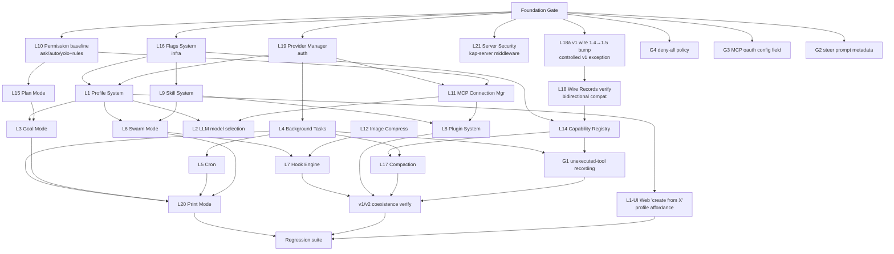

# Agent Core v2 Port & v1/v2 Coexistence — Design & Roadmap

> **Status**: Draft (brainstorming output, pending user review)
> **Date**: 2026-07-31
> **Owner**: Unassigned (to be assigned at kickoff)
> **Related**: `.tmp/agent-core-v1-v2-survey.md` (kimi-code), `agent-core-v1-v2-analysis.md`

## 0. Why v2 — Core Value & North Star

**This entire project exists to deliver one outcome: a multi-agent engine that mirri's web/desktop surfaces can actually build on. Everything else is in service of that.**

### 0.1 The problem with v1 (the "why now")

v1's `Session` (1123 lines), `Agent` (712 lines), and `MirriCore` (1802 lines) are **god-objects**: each mixes three lifecycles — process-global, per-session, per-agent — in one class. The `src/services/` layer (23 subdirs) uses flat `registerSingleton`, so a "session service" and a "process service" live at the same scope with no compile-time separation. This produces three concrete consequences that block mirri's web/desktop roadmap:

1. **No real multi-agent per session.** v1's `Session.createAgent()` builds a parent/child hierarchy where the child shares the parent's event bus, wire state, and tool registry. You cannot run two independent agents in one session, cannot `fork()` an agent's context, cannot fan a permission-mode change across all running agents. mirri's swarm mode (`L6`) is bolted on top of this limitation rather than natively supported.
2. **State management has three divergent code paths.** Live field mutation, `logRecord` (journal append), and `restoreXxx` (rebuild from journal) are manually kept in sync. Every feature added to v1 must touch all three or risk journal/replay drift. This is the single largest source of subtle bugs and the reason v1 features take disproportionately long to land safely.
3. **In-process coupling.** v1 is designed to run inside the CLI process. `kap-server`-style HTTP/WS hosting exists (`packages/server`) but the engine isn't shaped for it — the `MirriCore` orchestrator mixes "what the engine does" with "how the CLI drives it." The web/desktop path inherits this coupling.

### 0.2 What v2 changes (the core value)

v2 is not "v1 rewritten cleaner." It is a different **decomposition** that directly removes the three blockers above:

| v1 blocker | v2 architecture that removes it | What it unlocks for mirri |
|-----------|--------------------------------|---------------------------|
| God-object mixed scopes | **4-tier DI Scope** (App→Workspace→Session→Agent). Each agent is a child DI scope with its own `IEventBus`/`IWireService`/tool registry. | Independent agents per session; `fork()`; `broadcastPermissionMode()`. Swarm (`L6`) becomes native, not bolted-on. |
| Three state code paths | **Pure Model/Op/Reducer** (`defineModel`+`defineOp`+`WireService.dispatch()`). One call atomically updates state + persists + derives events; `restore()` reuses the same reducer; state is `Object.freeze`'d. | Every mirri feature ported to v2 gets journal/replay correctness for free. New features stop needing the "touch all three paths" tax. |
| In-process coupling | **Service-scoped engine + `kap-server` host + `klient` facade.** Engine is transport-agnostic; `kap-server` is one host, `klient/memory` is another (for tests). | web/desktop get a clean server boundary; tests get in-memory TDD without booting HTTP (§8.2). |
| Direct filesystem in business code | **Access-pattern Stores** (`IAppendLogStore`/`IAtomicDocumentStore`/`IBlobStore`/`IQueryStore`) with swappable backends. | Persistence becomes testable (memory backend) and backend-portable (future: cloud, encrypted). |

### 0.3 The North Star — v2 becomes the sole engine; this project is Phase 1

> **North Star (the whole arc): v2 becomes mirri's only agent engine. v1 is retired — its code paths deleted, its maintenance burden gone, every surface (TUI, web, desktop, ACP) running on v2.**

Carrying two engines forever is not a strategy; it is deferred debt — features developed twice, v1 stagnating, TUI and web behaving inconsistently. v2's architecture only earns its cost if it eventually stands alone.

But "retire v1" requires migrating the TUI and ACP — the largest single migration item (rewrite of `run-shell`, TUI session-event handler, all v1 SDK type bindings: session lifecycle, approval/question callbacks, slash commands, replay controller; then `node-sdk`→`klient`, `packages/server` retirement, `packages/agent-core` deletion). kimi-code itself has not completed this after extensive v2 work. Biting it off inside this project would double the scope and concentrate the risk.

**Therefore this project is Phase 1 of a two-phase arc toward the North Star:**

- **Phase 1 (THIS plan)** — Deliver a v2 engine that runs web/desktop, and **prove v2 can carry every mirri-unique feature at v1 fidelity**. Deliverable: v2 viable on web/desktop, feature-complete, coexisting with v1. v1 untouched except one controlled wire bump.
- **Phase 2 (separate, subsequent project)** — Migrate TUI + ACP onto v2, retire `packages/server` + `node-sdk` + `packages/agent-core`, delete v1 code paths. Phase 2's feasibility is **established by** Phase 1. Outline in §0.7.

### 0.4 The decision filter — "move toward the North Star" + "do not block Phase 2"

Every choice in Phase 1 is filtered through two questions, in order:

1. **Does this move toward the North Star?** (v2 becoming the sole engine)
2. **Does this keep Phase 2's path open?** (the "do not block v1 retirement" principle below)

Concrete rules and how each confirmed decision traces to them:

- **v2 must be able to stand alone.** No Phase-1 decision may make v2 depend on v1's continued existence. → v2 keeps its own `track2` telemetry (§13 Q3), its own persistence, its own kosong. No "bridge to v1" shortcuts that would have to be ripped out in Phase 2. *(This is also why "bridge" was rejected as the porting strategy in D1.)*
- **v2 must reach full feature fidelity.** A feature left on v1-only is a feature that blocks v1 retirement. → every mirri-unique capability in §3.4 must be ported, not bridged. Each B0–B3 feature subtask traces here.
- **Wire protocol must converge.** The v1 1.4→1.5 bump (§13 Q4, B0-L18a) puts v1 and v2 on the same version, so Phase 2's TUI migration doesn't also fight a version skew.
- **Don't entrench v1.** v1 receives no new features, no convenience helpers, no "just for now" APIs that Phase 2 would then have to preserve. The only v1 changes are the controlled wire bump and the conditional session-lock patch (evidence-gated from B4-COEX). → D2 (TUI/ACP stay on v1) traces here: we don't add v2 affordances to the v1 TUI path.
- **Don't design v1/v2 coexistence as permanent.** Shared `workspaces.json`, the `*Legacy` adapters, the backend switcher — these are **transition scaffolding**, not destination architecture. Phase 2 removes them. → D3 (foundation = mechanical port) and D4 (retain v1 wire via Legacy adapters) trace here: we don't polish scaffolding, we make it work well enough to prove v2.
- **Port rather than rewrite** (D1) → moves toward North Star: fastest path to a working v2; reuses 27 already-ported tools instead of re-deriving them.
- **Foundation = mechanical, gaps deferred** (D3) → moves toward North Star: unblocks the parallel feature work that actually delivers fidelity, as early as possible.
- **Session lock deferred** (§13 Q2) → doesn't block Phase 2: the lock (if needed) is transition scaffolding; Phase 2 removes the dual-writer scenario entirely.

When a subtask isn't traceable to either question, it's scope creep — stop and re-confirm.

### 0.5 Phase 1's acceptance (this project's North Star)

> By the end of Phase 1, a user opens mirri web (or desktop), points it at the v2 backend, and every mirri-unique feature — profiles, goals, swarm, plugins, hooks, cron, background tasks, MCP, model selection — works with the same fidelity as on v1, while gaining v2's multi-agent, replay-safe, testable foundation. v1 still runs (for TUI/ACP), but nothing new depends on it for web/desktop, and nothing in v2 depends on v1 continuing to exist.

This is Phase 1's definition of "done." Phase 2's definition of "done" is "v1 is deleted."

#### 0.5.1 Two non-negotiable fidelity targets (confirmed real user needs, not optional)

The fidelity audit (§3.5) found features where v2's architecture diverges enough that "works under v2" is not automatic — each needs upfront design work. **All are confirmed real, in-use mirri capabilities (not speculative), so reaching fidelity is a hard acceptance target of Phase 1, not a stretch goal:**

1. **Tool Capability Registry (L14)** — mirri's `CapabilityRegistry` + `integrations.yaml` + `capabilitiesRequired` is actively used: builtin profiles (`plan.yaml`, `explore.yaml`) declare `capabilitiesRequired`, `agent/index.ts:443` reads it at agent setup, `code.explore`/`code.read`/`web.search`/`web.fetch` capability tags drive MCP-tool preference ordering. **v2 has no capability concept at all.** Phase 1 must deliver a working capability layer on v2 — otherwise MCP-provided alternative tools break and profile capability requirements silently no-op. (B1-L14, with mini-design.)

2. **Unexecuted-tool-call recording (G1)** — when a provider stream breaks mid-tool-call, v1 records the declared-but-never-run call with sanitized args + a synthetic error result + a "re-issue if needed" prompt, so the model learns the call didn't run and the wire journal stays valid. **v2 silently drops these calls**, risking lost model intent, empty-assistant-message rejections by strict providers, and hard-to-reproduce misbehavior. This is a correctness defect, not a missing convenience. Phase 1 must close this gap on v2. (B3-G1, with mini-design.)

**If either cannot be made to work on v2, Phase 1's North Star is not met** — the feature would be a regression from v1, violating the "same fidelity" promise. Escalate immediately rather than shipping a degraded port.

#### 0.5.2 L1 Profile `extends` — simplified, not a v2-engine concern

Originally audited as 🔴 Risky, **L1 is downgraded to 🟢 Simplified** based on a design clarification: `extends`'s real value is *convenience for defining new profiles* ("start from X and tweak"), not a runtime inheritance mechanism. Therefore it belongs in the UI (a "create from X" quick-input that prefills fields), not in v2's persisted config format or runtime. v2's self-contained `AgentProfile` is exactly right.

- **Builtin profiles** (`agent`/`coder`/`explore`/`plan`, 3 of which `extends: agent`): flatten to self-contained YAML at port time (drop `extends`, write shared fields like `systemPromptPath` in full). One-time build-time change.
- **User custom profiles**: stored self-contained (v2 already does this). `extends` never enters v2's config schema.
- **Convenience**: a "create profile from X" affordance in the web UI prefilling the form. This is a web-UI feature task, not a v2-engine task — and it's small enough to be a nice-to-have in Phase 1, not a blocker.

No `extends` resolution, no partial-merge, no cycle detection ported to v2. `defaultModel` stays a plain profile field. `capabilitiesRequired` stays a field (folds into L14's capability work). **L1 is no longer a design risk.**

### 0.6 What Phase 1 explicitly is NOT

- It is not "retire v1." v1 keeps running for TUI/ACP. Retirement is Phase 2.
- It is not "feature parity as a checkbox list." A feature "ported" but broken under concurrent multi-agent load does not count — fidelity means correctness under v2's architecture, not just "the API exists."
- It is not "catch up to kimi-code upstream." We pin one SHA (§13 Q1) and port from there; future upstream re-sync is a separate project.
- It is not "re-architect mirri's whole stack." `packages/telemetry`, `packages/oauth`, `packages/kosong`, `packages/kaos` stay as-is; only the four v2 packages are added.
- It is not "permanent v1/v2 coexistence." Coexistence is the transition state, not the destination.

**When in doubt during implementation, re-read §0.4. If a subtask isn't traceable to "v2 stands alone eventually" or "reach feature fidelity," it's scope creep — stop and re-confirm.**

### 0.7 Phase 2 outline (for planning, not execution in this project)

Phase 2 is a separate project, sketched here only so Phase 1's "don't block it" principle has a concrete target:

1. **TUI migration** — rewrite `apps/mirri-code` harness on `@mirri-ai/klient` (ipc transport); replace v1 SDK type bindings with klient's `session(id).*`/`agent(id).*` facade; port session-event handler, approval/question reverse-RPC, slash commands, replay controller, subagent event streams.
2. **ACP migration** — rewrite `packages/acp-adapter` on v2 (currently wraps v1 `Session` with direct v1 type imports).
3. **SDK transition** — `@mirri-ai/node-sdk` either becomes a thin wrapper over `klient`, or is retired in favor of `klient` as the public harness API.
4. **Server retirement** — `packages/server` (v1) deleted; `kap-server` becomes the sole server. `apps/mirri-code server run` starts kap-server.
5. **v1 deletion** — `packages/agent-core` deleted. Shared `workspaces.json` format becomes v2-owned. `*Legacy` adapters removed (native v2 wire surface, still `/api/v1` or a new `/api/v2`).
6. **Transition scaffolding removal** — backend switcher (dev-only, already harmless), shared workspace registry lock logic (if added), wire 1.5 migration code (folded into v2-only).

Phase 2 is gated on Phase 1's DoD (§11). Phase 1 does **not** start Phase 2 work, but must not foreclose any of the above.

---

## 1. Background & Goal

Mirri Code currently runs on a single agent engine — `packages/agent-core` (v1, a fork of kimi-code's v1). The upstream kimi-code project has since developed a **v2 engine** (`agent-core-v2` + `kap-server` + `transcript` + `klient`) built on a 4-tier DI×Scope architecture (App → Workspace → Session → Agent), with pure Model/Op/Reducer state management and access-pattern-abstracted persistence. v2 is the engine behind kimi-code's `web`/`desktop` surfaces, while its TUI/ACP remain on v1.

**Goal**: Port kimi-code's v2 engine stack into mirricode, rebrand it to the `@mirri-ai/*` / `MIRRICODE_*` namespace, and make it coexist with the existing v1 — **without touching v1's internals** — so that `apps/mirri-web` and `apps/mirri-desktop` can switch between v1 and v2 engines at runtime, and all mirri-unique features work correctly under the v2 engine.

### Non-goals (out of scope)

- Migrating the TUI (`apps/mirri-code`) or ACP adapter to v2. These stay on v1 indefinitely (mirrors kimi-code's stance).
- Implementing kimi-code's designed-but-unbuilt native `/api/v2` action surface. We keep the v1 `/api/v1` wire protocol via `*Legacy` adapters.
- Modifying any v1 business logic. v1 is frozen **except** the controlled wire-protocol bump 1.4→1.5 (§13 Q4, B0-L18a) and a possible conditional session-lock patch arising from B4-COEX evidence. Both exceptions are narrow, evidence-justified, and called out explicitly — not open season on v1.
- Fixing the 4 known v2 functional gaps during the foundation phase — they are feature-phase work.

## 2. Confirmed Decisions

| # | Decision | Rationale |
|---|----------|-----------|
| D1 | **Port kimi-code's v2 packages + adapt** (not semantic rewrite, not bridge) | Reuses 27 already-ported tools, wire model, persistence abstractions. Estimated weeks-to-2-months vs. months for rewrite. Inherits v2's known gaps, addressed in feature phase. |
| D2 | **TUI/ACP stay on v1; only web/desktop use v2** | Mirrors kimi-code. Lowest risk, smallest scope. v1 remains the stable, long-supported path for TUI/ACP. |
| D3 | **Foundation = pure mechanical port + rebrand; gaps & mirri differences → feature phase** | Unblocks parallel feature work fastest. Foundation is the shortest serial prerequisite. |
| D4 | **Retain v1 wire protocol** (`/api/v1` + `*Legacy` adapters) | Web UI stays single-binary-both-backends. Aligns with kimi-code. |
| D5 | **Full namespace rebrand** `@moonshot-ai/*`→`@mirri-ai/*`, `KIMI_CODE_*`→`MIRRICODE_*`, `kimi`→`mirri` across all four v2 packages | Consistency with mirricode namespace. |
| D6 | **Port server security hardening to kap-server** (bind classification, bearer auth, rate limit, Host/Origin) | mirricode hard requirement; kimi-code's kap-server has a different security posture. |
| D7 | **Shared workspace registry** (`<homeDir>/workspaces.json`) read/written by both v1 and v2 | TUI-created sessions surface in web(v2) and vice versa. Already forward-compatible per `core-impl.ts` / `workspaceRegistryFile.ts` comments. |

## 3. Current State & Gap Analysis

### 3.1 Mirricode v1 today

- `packages/agent-core` — v1 engine, 22 `src/services/` subdirs (VSCode-style `registerSingleton`), god-object `Session`/`Agent`/`MirriCore`, hand-written RPC (`core-api.ts` + `core-impl.ts`), direct filesystem persistence (`FileSystemAgentRecordPersistence`).
- `packages/server` — v1 REST+WS server, `/api/v1`, Fastify, bearer auth, bind classification. Consumed in-process by `apps/mirri-code server run`.
- `apps/mirri-code` — TUI, consumes `@mirri-ai/mirri-code-sdk` (never `@mirri-ai/agent-core` directly).
- `apps/mirri-web` / `apps/mirri-desktop` — Vue 3 / Electron, talk to server over `/api/v1`, re-implement wire types locally, **already have a dev-only backend switcher** (Sidebar pill reading `/meta.backend`, `GET/POST /__mirri-dev/backend`). Presets: v1 `http://127.0.0.1:58627`, v2 `http://127.0.0.1:56129`.
- `pnpm dev:v2` script exists but only runs the **v1** server with experimental flags on port 56129 — **no actual v2 packages are present in the repo**.

### 3.2 Kimi-code v2 architecture summary

| Package | Path | Role |
|---------|------|------|
| `agent-core-v2` | `packages/agent-core-v2/` | DI×Scope engine: `_base/di/`, `app/`, `workspace/`, `session/`, `agent/`, `wire/` (Model/Op/Reducer), `persistence/` (IAppendLogStore/IAtomicDocumentStore/IBlobStore/IQueryStore + backends), `os/` (absorbs former `kaos`), `kosong/` (inlined LLM provider), `tool/` |
| `kap-server` | `packages/kap-server/` | Fastify 5 + ws; `startServer()` → `bootstrap()`; 26 route modules under `/api/v1`; `backend:'v2'` in `/meta`; reflective debug RPC |
| `transcript` | `packages/transcript/` | 4-layer transcript: L1 Store → L2 Ops → L3 Granularity → L4 View + pagination |
| `klient` | `packages/klient/` | Typed scope-layered facade client (`global.*`/`session(id).*`/`agent(id).*`), zod-validated, `ipc` + `memory` transports |

Key v2 properties:
- 4-tier `LifecycleScope` (App=0, Workspace=1, Session=2, Agent=3); each agent is a child DI scope with own `IEventBus`/`IWireService`.
- Flat agent registry per session (`IAgentLifecycleService`), `MAIN_AGENT_ID='main'`, agents have no nesting, supports `fork()` and `broadcastPermissionMode()`.
- Pure state: `defineModel` + `defineOp` (zod-schema'd reducer) + `WireService.dispatch()` atomically updates state + persists + derives events; `restore()` reuses the same reducer; state is `Object.freeze`'d.
- Persistence via access-pattern interfaces; business code never touches `node:fs`.
- All 27 v1 tools have v2 counterparts (bash/read/write/edit/glob/grep → `agent/tools/os/*`, agent → `agent/tools/agent/`, etc.).

### 3.3 Known v2 functional gaps (inherited, fix in feature phase)

| ID | Gap | Impact |
|----|-----|--------|
| G1 | **Unexecuted tool calls not recorded** — when a provider stream breaks before a tool call starts executing, v1 records "declared but not run" calls (sanitized args + synthetic error + retry prompt); v2's `settleOpenStep`/`closePending` only handles already-dispatched calls | High — v2 may silently lose tool-call intent, model gets no "retry these" signal |
| G2 | `steer()` doesn't update prompt metadata — session title stays stale during goal pursuit | Med |
| G3 | MCP `auth: 'oauth'` config field missing from v2's `agent/mcp/config-schema.ts` (v1 `config/schema.ts:285-286` has it) | Low — OAuth runtime still works via 401 auto-discovery, but config-driven UI hints gone |
| G4 | `deny-all` permission policy has no explicit v2 counterpart (v1 has `policies/deny-all.ts`) | Low — `permissionGate` can cover scenario but no named policy object |

### 3.4 Mirri-unique feature catalog (must work under v2)

These 21 capabilities diverge from upstream kimi-code and **must be ported/verified on v2**. (ACP adapter L13 stays on v1 and is out of v2 scope per D2.)

| ID | Feature | v1 Path | v2 Target Scope |
|----|---------|---------|-----------------|
| L1 | Agent Profile System (custom agents, `extends` inheritance, enable/disable, dynamic subagent discovery) | `src/profile/`, `src/services/profile/` | Session (`sessionAgentProfileCatalog`) + Agent (`agent/profile`) |
| L2 | LLM-aware model selection for subagents (3-tier: LLM-specified → profile defaultModel → parent; curated catalog injection) | `src/tools/builtin/collaboration/agent.ts`, `agent-swarm.ts` | Agent (`agent/tools/agent/`, `agent/swarm/`) |
| L3 | Goal Mode (durable, budget limits, completion criteria, pause/resume/cancel) | `src/agent/goal/` | Agent (`agent/goal/`) |
| L4 | Background Task Manager (persistent shell/question/agent, detach/stop/output, print-mode drain) | `src/agent/background/` | Agent (`agent/task/`, `session/process/`, `session/terminal/`) |
| L5 | Cron / Scheduled Tasks (CRON expr, persisted, per-agent) | `src/agent/cron/` | Session (`session/cron/`) |
| L6 | Swarm Mode (manual/task/tool triggers, AgentSwarm tool) | `src/agent/swarm/` | Session (`session/swarm/`) + Agent (`agent/swarm/`) |
| L7 | Hook Engine (PreToolUse/PostToolUse/Notification, block/allow/rewrite, timeout) | `src/session/hooks/` | Session (`session/externalHooks/`) + Agent (`agent/externalHooks/`) |
| L8 | Plugin System (marketplace, `mirri.plugin.json`, GitHub resolver, download/extract, plugin commands/MCP/session-start injections) | `src/plugin/`, `plugins/` | Workspace (`workspaceMcpConfig/` plugin contributions) + Session |
| L9 | Skill System (6 builtins, fs discovery, builtin/user/project/extra roots) | `src/skill/`, `src/agent/skill/` | Session (`sessionSkillCatalog/`, `workspaceSkillCatalog/`) + Agent (`agent/skill/`) |
| L10 | Permission System (ask/auto/yolo, rules, parent-child inheritance, session rules) | `src/agent/permission/` | Agent (`agent/permissionGate/`,`permissionMode/`,`permissionPolicy/`,`permissionRules/`,`toolApproval/`) |
| L11 | MCP Connection Manager (stdio/HTTP/SSE, OAuth, `mcp__<server>__<tool>` naming, enable/disable per-server/per-tool, global MCP) | `src/mcp/`, `src/services/mcp/` | Workspace (`workspaceMcp/` shared connections, `workspaceMcpConfig/`) + Agent (`agent/mcp/`) |
| L12 | Image Compression Pipeline (compress, format conversion, crop, caption injection, original preservation) | `src/tools/support/` | Agent (`agent/tools/os/*` image handling, `agent/media/`) |
| L13 | ACP Adapter | `packages/acp-adapter/` | **Out of v2 scope** (stays on v1 per D2) |
| L14 | Capability Registry + Integrations (`code.explore`/`code.read`/`web.search`/`web.fetch`, `integrations.yaml`, `capabilitiesRequired` in profiles) | `src/agent/tool/capabilities.ts`, `src/loop/tool-access.ts` | Agent (`agent/toolRegistry/`, `agent/toolPolicy/`) |
| L15 | Plan Mode (read-only agent, no tool execution) | `src/agent/plan/` | Agent (`agent/plan/`) |
| L16 | Experimental Flags System (`MIRRICODE_EXPERIMENTAL_*`, master switch, scoped resolvers) | `src/flags/` | App (`app/flags/` or equivalent) — **infra, other features depend on it** |
| L17 | Compaction (full + micro, handoff summaries) | `src/agent/compaction/` | Agent (`agent/fullCompaction/`, `agent/contextMemory/`) |
| L18 | Wire Records + Replay (deterministic `wire.jsonl` journal, `AGENT_WIRE_PROTOCOL_VERSION`, blob store, resume, migration) | `src/agent/records/`, `src/agent/replay/` | Agent (`agent/blob/`, `wire/`) — **verify mirri wire-protocol-version compatibility** |
| L19 | Provider Manager (model alias resolution, bearer + OAuth token provider, per-model auth) | `src/session/provider-manager.ts` | App (`app/kosong/provider/`, `app/kosong/model/`) |
| L20 | Print Mode (`mirri -p`, headless single-prompt, drain/steer/exit policies, max turns) | spread across Session/BackgroundManager/MirriCore | App bootstrap + Agent loop (drain policy) |
| L21 | Server Security Hardening (bind classification, bearer auth, rate limit, Host/Origin, TLS gate, dangerous-endpoint downgrade) | `packages/server/src/middleware/`, `src/services/auth/` | `kap-server` middleware (port mirri's hardening onto kap-server) |

### 3.5 Fidelity audit — will mirri features actually work under v2?

A feature being "in scope" (§3.4) is not the same as it *working*. This audit (conducted against kimi-code v2 at SHA `764887473`) compares each feature's v1 implementation against the v2 target architecture and classifies fidelity:

| ID | Feature | Verdict | Key gap / what the port must add beyond mechanical translation |
|----|---------|---------|---------------------------------------------------------------|
| L3 | Goal Mode | ✅ **Full** | v2's `IGoalService` has budgets (turns/tokens/wall-clock), completion criteria, continuation driver, `GoalInjection`. Port = rebrand only. |
| L4 | Background Tasks | ✅ **Full** | v2's `IAgentTaskService` + `AgentTaskPersistence` (per-agent, survives resume) + print-mode drain. Port = rebrand only. |
| L8 | Plugin System | ✅ **Full** | v2 already has full `IPluginService` (GitHub resolver, archive, manifest, commands, MCP servers, session-start injection). Port = rebrand only. |
| L15 | Plan Mode | ✅ **Full** | v2's `planService.ts` already implements read-only guard via `onBeforeExecuteTool` (cleaner than v1's permission-chain approach). Port = nothing. |
| L12 | Image Compression | ✅ **Full** | v2's `agent/media/` is a *superset* of v1 (compression, format policy, originals, crop, caption, *plus* video). Port = path/branding rename only. |
| L10 | Permission | ✅ **Full** | v2's 5-service permission redesign has identical semantics (manual/auto/yolo, rules, approval). Add only swarm/goal-specific policies. |
| L21 | Server Security | ✅ **Full** | kap-server already has every mirri hardening middleware (auth, rate-limit, hostnames, origin, bind classify, security headers). Port = env-var rename only. |
| L16 | Flags | 🟡 **Partial** | Rename env prefix `KIMI_CODE_*`→`MIRRICODE_*`; re-register mirri's flags via v2's decentralized `registerFlagDefinition()`; restore `tool-select`↔`dynamically_loaded_tools` capability wiring. *Minor*: v2's decentralized registry loses v1's literal `FlagId` union (compile-time typo check) — acceptable. |
| L9 | Skill | 🟡 **Partial** | Add `.mirri-code/skills` to v2's brand-dir arrays; replace v2's builtin skill set with mirri's 6. Discovery/priority/dedup mechanics match. |
| L19 | Provider | 🟡 **Partial** | Re-add `mirriRequestHeaders` (device identity) injection into v2's kosong config adapter; port `parseMirriCodeCustomHeaders()` from `@mirri-ai/mirri-code-oauth`; add `dynamically_loaded_tools` to v2's `ModelCapability` resolution. |
| L18 | Wire Records | 🟡 **Partial** | Add `toolSelect` field to v2's LLM request op; verify every mirri-specific op (`goal.*`, `plan_mode.*`, `swarm_mode.*`, `cron.*`, `permission.*`) is registered in v2's `PersistedOpMap`; verify the 1.4→1.5 migration covers them all. |
| L11 | MCP | 🟡 **Partial** | Load mirri's global MCP config (`~/.mirri-code/mcp.json`) into v2's workspace MCP config; verify session-specific MCP overrides. *Note*: v2's workspace-shared connections are an *improvement* (resource efficiency), not a gap — but session isolation is weaker, acceptable. |
| L2 | Model Selection | 🟡 **Partial** | **v2's `model` param is `z.enum(['secondary','primary'])`, not an open alias.** This is likely *intentional* (pairs with v2's `secondary-model` flag + `modelPreference`). Do NOT blindly revert to `z.string()` — at B2-L2 design time, first determine *why* v2 chose the enum (check `secondary-model` flag semantics, `resolveSubagentBinding`). Then decide: either (a) revert to open alias + curated catalog + invalid-alias error feedback (mirri's v1 behavior), ensuring the enum's model-preference mechanism is preserved separately, or (b) adapt mirri's model-selection to v2's primary/secondary model-preference concept. Add curated catalog injection into tool description regardless. |
| L5 | Cron | 🟡 **Partial** | **v2 cron is Session-scoped; mirri cron is per-agent.** Either accept session-level (if subagents never schedule cron) or add `agentId` tagging + filtering to v2's `SessionCronServiceImpl`. Decide at B2-L5 design time. |
| L6 | Swarm | 🟡 **Partial** | Trigger types (`manual`/`task`/`tool`) match v2's `SwarmModeTrigger`. Add: `shouldAutoExit` logic for task/tool triggers; enter/exit system-reminder injection; `restoreEnter()` for wire-replay recovery. |
| L7 | Hook Engine | 🟡 **Partial** | v2's `HookResult` type is missing `updatedInput` and `additionalContext` (parsing exists but result is discarded); register `hook-command-rewrite` flag in v2; wire `updatedInput` application through the runner into tool execution. |
| L17 | Compaction | 🟡 **Partial** | Core flow (summarize + prune + handoff) equivalent. Add: wire `additionalContext` from `PreCompact` hook results into context memory before compaction (v1 does this, v2 doesn't). |
| **L14** | **Capability Registry** | 🔴 **Risky** | **v2 has NO capability concept** — its tool filtering is a name allowlist. Must build capability layer on top: add `capabilities: string[]` to tool metadata, `capabilitiesRequired: string[]` to `AgentProfile`, port `integrations.yaml` + `preferOver` ordering, wire capability→tool resolution into profile binding. **Design decision required before implementation.** |
| **L1** | **Profile `extends`** | 🟢 **Simplified** | **Decision (simplification): `extends` does NOT enter v2's config format or runtime.** `extends` is a *convenience for defining new profiles*, not a runtime inheritance mechanism. Its real value = "start from an existing profile and tweak" — which belongs in the UI (a "create from X" quick-input that prefills fields), not in the persisted config. v2's `AgentProfile` is self-contained (no `extends`), which is exactly right. **Port = (a) flatten mirri's 4 builtin profiles** (`agent`/`coder`/`explore`/`plan` — 3 of which `extends: agent`) to self-contained YAML, dropping the `extends` field (build-time, one-time change); **(b) add a "create profile from X" affordance in the web UI** (prefill, user edits, store flattened). No `extends` resolution, no partial-merge, no cycle detection ported to v2. `defaultModel` and `capabilitiesRequired` remain as profile *fields* (not inheritance) — `capabilitiesRequired` folds into L14's capability work. Downgraded from 🔴 Risky to 🟢 Simplified. |
| **G1** | **Unexecuted-tool recording** | 🔴 **Risky** | v2's `settleOpenStep`/`closePending` only handle *already-dispatched* tool calls. Declared-but-never-dispatched calls (from broken streams) are silently dropped. Port `recordUnexecutedToolCalls` into v2's loop step-failure path: parse partial args (unparseable→`{}`), dispatch `tool.call` + `tool.result` with synthetic error + retry prompt. Touches step-completion path but not the turn state machine itself. |

**Bottom line**: 7 features work as-is (rebrand-only), 10 work after specified gaps are filled, 3 require upfront design work before implementation can start. **No feature is Blocked** (v2's architecture can support all 21), but L14/L1/G1 each need a mini-design doc before their B-batch subtask begins. These mini-designs are deliverables of the subtask's TDD step 1 ("read v1 + v2, understand"), not separate project phases.

## 4. Overall Architecture

### 4.1 Package structure after porting

```
mirricode/packages/
├── agent-core/          ← v1, FROZEN (only workspaces.json shared format)
├── agent-core-v2/       ← NEW: ported from kimi-code + rebranded @mirri-ai/*
├── kap-server/          ← NEW: v2 HTTP+WS server (replaces packages/server role on v2 path)
├── transcript/          ← NEW: v2 4-layer transcript data layer
├── klient/              ← NEW: v2 scope-layered typed facade client (ipc/memory)
├── server/              ← v1 server, unchanged (TUI/ACP use it)
├── node-sdk/            ← v1 SDK, unchanged (TUI uses it)
├── kosong/ kaos/ oauth/ acp-adapter/ protocol/ pi-tui/ telemetry/ server-e2e/  ← unchanged
```

**Dependency rules** (enforced by lint/review):
- `apps/mirri-web`, `apps/mirri-desktop` — **must NOT** import `@mirri-ai/agent-core-v2` directly; wire types re-implemented locally (matches current v1 rule).
- `kap-server` — the **only** package allowed to depend on `@mirri-ai/agent-core-v2`.
- `klient` — depends on `agent-core-v2` types only (for the facade contract); transports are `ipc` (CLI) and `memory` (tests).
- `transcript` — depends on `agent-core-v2` wire types only.
- `apps/mirri-code` (TUI) — unchanged, still uses `@mirri-ai/mirri-code-sdk` (v1). **No v2 imports.**

### 4.2 Phase-1 internal cadence (Foundation → Feature)

> **Terminology note**: §0 uses "Phase 1 / Phase 2" for the *whole v2 arc* (Phase 1 = this project, Phase 2 = TUI migration + v1 retirement). This §4.2 describes Phase 1's *internal* two-step cadence — Foundation (serial) then Feature (parallel) — and is unrelated to the §0 arc phases.

```
═══════════════════════ FOUNDATION (serial, single agent) ═══════════════════════
  F1  Copy 4 packages + mechanical rebrand + workspace/flake registration
  F2  kap-server: wire mirri config/auth/workspace + /meta returns backend:v2
  F3  web switcher → real v2 backend + end-to-end smoke (green path)
  F4  v2 test bed (klient memory transport + vitest scaffold + shared fixtures)
        ─── GATE: v2 serves an empty session + one round-trip turn ───
═══════════════════════ FEATURE (parallel, multi-agent) ═══════════════════════
  B0  infra & low-dependency (flags, provider, permission baseline, security, wire-record verify, 3 of 4 v2 gaps)
  B1  core agent services (profile, mcp, plan, capability, skill, image-compress)
  B2  orchestration (goal, cron, background, swarm, llm-model-selection)
  B3  integration hooks (hook engine, plugin, compaction, G1 unexecuted-tool recording)
  B4  end-to-end (print mode, v1/v2 coexistence verification, regression)
```

### 4.3 v1/v2 coexistence contract (three invariants)

1. **Shared workspace registry** — `<homeDir>/workspaces.json` is read/written by both v1 (`packages/agent-core/src/services/workspace/workspaceRegistryFile.ts`) and v2 (`kap-server` workspace lifecycle). Format already forward-compatible. A v1-created session appears in the web(v2) session list and vice versa.
2. **Unified wire protocol** — both servers expose `/api/v1` REST+WS with the same route shapes. v2 uses `*Legacy` adapters to maintain v1 wire compatibility. The web UI is a single binary that can connect to either.
3. **`/meta.backend` discriminator** — `GET /api/v1/meta` returns `backend: 'v2'` (kap-server) or omits the field (v1 server). The web UI already keys its switcher pill off this field.

### 4.4 YAGNI boundaries (explicitly NOT doing)

- ❌ TUI/ACP v2 migration
- ❌ Native `/api/v2` action surface
- ❌ Removing `*Legacy` adapters
- ❌ Any v1 business-logic change — **except** the controlled wire-protocol bump 1.4→1.5 (B0-L18a, §13 Q4) and a possible evidence-gated session-lock patch from B4-COEX. Both are narrow and explicitly scoped, not open season on v1.
- ❌ v2→v1 feature backport (v2 features don't get ported back to v1)
- ❌ New web UI work (switcher already exists; only point it at real v2)

## 5. Foundation Phase (serial)

One agent executes F1→F2→F3→F4 in order. Each step has a concrete deliverable and gate.

### F1 — Copy, rebrand, register (est. 1 day)

**Input**: kimi-code `packages/agent-core-v2/`, `packages/kap-server/`, `packages/transcript/`, `packages/klient/`.

**Steps**:
1. Copy the four packages verbatim into `mirricode/packages/`.
2. Mechanical rebrand (scripted, deterministic):
   - Package names: `@moonshot-ai/*` → `@mirri-ai/*` in all four `package.json` files and all `import`/`require`/`workspace:*` references.
   - Env vars: `KIMI_CODE_EXPERIMENTAL_*` → `MIRRICODE_EXPERIMENTAL_*`, `KIMI_BACKEND_*` → `MIRRICODE_BACKEND_*`.
   - Binary/cli names: `kimi` → `mirri` in bin entries, help text, log prefixes.
   - File-path references: `~/.kimi-code/` → `~/.mirri-code/`, `kimi-code` home dir → `mirri-code` home dir.
   - String literals in telemetry events, error messages, comments referencing "kimi" → "mirri" (preserve upstream-attribution comments where appropriate).
3. **Resolve the `@moonshot-ai/kimi-code-oauth` dependency** (P-oauth). `agent-core-v2` and `kap-server` both depend on it and import symbols deeply (`KimiHostIdentity`, `KIMI_CODE_PROVIDER_NAME`, `parseKimiCodeCustomHeaders`, `createKimiDeviceId`, OAuth protocol types) across auth/kosong/web/plugin/bootstrap. mirricode has `packages/oauth` (`@mirri-ai/mirri-code-oauth`) but it is mirri's own package — its API surface is NOT guaranteed to match what v2 imports. **Decision at F1 start**:
   - **Option A (rebrand the oauth package too)**: copy kimi-code's `packages/kimi-code-oauth` into mirricode as `@mirri-ai/mirri-code-oauth` (or reuse mirri's existing `packages/oauth` if its API is compatible — verify by diffing exported symbols against v2's imports). Lower risk — v2's imports resolve unchanged.
   - **Option B (point v2 at mirri's existing oauth)**: change v2's imports to `@mirri-ai/mirri-code-oauth` and adapt the imported symbols. Higher effort — touches auth/kosong/web/plugin across agent-core-v2.
   - **Recommended: Option A.** Reuse is tempting but the import surface (`KimiHostIdentity`, `parseKimiCodeCustomHeaders`, `createKimiDeviceId`) is kimi-specific; treat the oauth package as a 5th v2 package to port+rebrand. Note: this may make `packages/oauth` (mirri's existing) redundant — audit for duplication at F1.
4. Register in workspace:
   - `pnpm-workspace.yaml` already uses `packages/*` glob — packages land automatically.
   - **Manually update `flake.nix`** `workspacePaths` and `workspaceNames` for all four v2 packages (plus the oauth package from step 3 if Option A) (per AGENTS.md hard rule — the automated check only validates the `@mirri-ai/mirri-code` closure, leaf packages slip through).
5. `pnpm install` + typecheck all four packages pass.

**Deliverable**: Four (or five, if oauth ported) packages present, rebranded, installable, typechecking. No behavior changes yet.

**Gate F1**: `pnpm --filter @mirri-ai/agent-core-v2 run typecheck` (and the others) all green.

### F2 — kap-server integration (est. 1 day)

**Steps**:
1. `kap-server/src/start.ts` reads mirri config (`<homeDir>/config.toml`, mirri config schema) instead of kimi config.
2. Auth: port mirri's bearer-token + optional `MIRRICODE_PASSWORD` (bcrypt) + `--dangerous-bypass-auth` from `packages/server/src/services/auth/`. Replace kimi-code's auth posture (D6).
3. Bind classification: port mirri's loopback/LAN/public classification, TLS gate, Host/Origin checks, rate limiting, dangerous-endpoint downgrade from `packages/server/src/middleware/`.
4. Workspace: `kap-server` workspace lifecycle reads/writes the **same** `<homeDir>/workspaces.json` as v1 (shared registry, invariant #1).
5. `/meta` returns `backend: 'v2'` plus mirri's existing meta fields (version, id, startedAt, auth state).
6. Routes: verify all 26 route modules still register under `/api/v1`; the `*Legacy` adapters stay (D4).

**Deliverable**: `kap-server` boots with mirri config, mirri auth, mirri workspace file; `/meta` reports v2.

**Gate F2**: `curl http://127.0.0.1:56129/api/v1/meta` returns `{ "backend": "v2", ... }` with mirri auth enforced; `workspaces.json` shared with a concurrently-running v1 server.

### F3 — web switcher → real v2 + smoke (est. 0.5 day)

**Steps**:
1. The web UI dev switcher already exists (`apps/mirri-web/src/components/Sidebar.vue`, `vite.config.ts` `backendSwitcherPlugin`, presets `default`/`multi`). Point the `multi` preset at the real kap-server from F2 (port 56129).
2. Boot v1 server (port 58627) + kap-server (port 56129) concurrently.
3. In the web UI, switch between backends via the Sidebar pill; verify `/meta.backend` flips `v1`↔`v2` and the page reloads cleanly.
4. Smoke: create an empty session on the v2 backend, send one prompt, receive one response (no tools). This proves the green path: web → kap-server → agent-core-v2 → kosong → LLM → back.

**Deliverable**: A developer can run both backends and flip the web UI between them live; one round-trip turn works on v2.

**Gate F3** (the **foundation gate**): empty session + one no-tool turn succeeds end-to-end on the v2 backend, observed in the web UI.

### F4 — v2 test bed (est. 1 day)

**Steps**:
1. `klient` memory transport is already designed for testing (`@mirri-ai/klient/memory`). Wire it into a vitest test harness that boots `bootstrap()` in-process (no HTTP server) and drives the engine via the typed facade.
2. Create `packages/agent-core-v2/test/_mirri-harness/` with shared fixtures:
   - A minimal provider stub (returns canned LLM responses).
   - A temp-home-dir helper.
   - A "one empty session + one turn" golden test.
3. Add the harness as an importable test utility (re-export from `klient/memory` or a small `_mirri-test-utils` entrypoint).
4. Document the TDD workflow for feature-phase agents (see §8).

**Deliverable**: Every feature-phase subtask can write its first failing test as `harness.session().agent('main').prompt(...)` without booting a server.

**Gate F4**: the golden "one turn" test passes against the in-memory transport; `pnpm --filter @mirri-ai/agent-core-v2 exec vitest run` is green.

## 6. Feature Phase (parallel)

### 6.1 Dependency graph



### 6.2 Parallel batches

#### B0 — Infra & low-dependency (9 subtasks, all independent, up to 9 agents)

| ID | Subtask | Deps | v2 touch points | TDD seed |
|----|---------|------|-----------------|----------|
| B0-L16 | Port mirri experimental flags system onto v2's App scope (`MIRRICODE_EXPERIMENTAL_*`, master switch, scoped resolvers on App/Session/Agent) | F-gate | `agent-core-v2/src/app/` (new `flags/`), wire into bootstrap | Assert `flags.enabled('x')` reads env + config + default |
| B0-L19 | Port Provider Manager onto v2's inlined kosong (`app/kosong/provider/`, `app/kosong/model/`); bearer + OAuth token provider; per-model auth injection | F-gate | `agent-core-v2/src/app/kosong/` | Assert model alias resolves to provider config with auth |
| B0-L10 | Port Permission baseline (ask/auto/yolo modes, rule matching, parent-child inheritance, session-level rules from config) onto v2's 5 permission services | F-gate | `agent-core-v2/src/agent/permissionGate/`,`permissionMode/`,`permissionPolicy/`,`permissionRules/`,`toolApproval/` | Assert auto-approves allowlisted tool, ask blocks unknown |
| B0-L21 | Port mirri server security hardening onto kap-server (bind classification, bearer auth, rate limit, Host/Origin, TLS gate, dangerous-endpoint downgrade) | F2 | `kap-server/src/middleware/`, `kap-server/src/services/auth/` | Assert non-loopback bind without TLS rejected; rate limit triggers |
| B0-L18a | **Bump mirri v1 wire protocol 1.4 → 1.5** (controlled exception to "v1 frozen", per §13 Q4). Copy kimi's `v1.5.ts` migration into `packages/agent-core/src/agent/records/migration/`, append to `MIGRATIONS` array, bump `AGENT_WIRE_PROTOCOL_VERSION` to `'1.5'`. Highly isolated — migration infra is structurally identical to kimi's. **Expected v1 test updates** (not regressions): `test/agent/records/migration/v1.4.test.ts` stays (tests 1.3→1.4); add `test/agent/records/migration/v1.5.test.ts` (tests 1.4→1.5); `test/agent/resume.test.ts` and `test/agent/records/index.test.ts` assert `protocol_version: AGENT_WIRE_PROTOCOL_VERSION` (line refs: `resume.test.ts:28,1347`) — these auto-pass since they read the constant, no edit needed. Run v1's full `records/` + `resume` test suites to verify. | F-gate | `packages/agent-core/src/agent/records/migration/index.ts`, new `v1.5.ts`, new `test/agent/records/migration/v1.5.test.ts` | Assert v1 reads/writes 1.5; v1.4 sessions auto-migrate on resume; migration test suite green |
| B0-L18 | Verify mirri↔v2 wire-record bidirectional compatibility (now both at 1.5 after B0-L18a): v2's `wire/` + `agent/blob/` read/write `wire.jsonl` same format; cross-resume v1↔v2 without field loss | F-gate, B0-L18a | `agent-core-v2/src/wire/`, `src/agent/blob/` | Assert a v1-written `wire.jsonl` resumes in v2 and vice versa, no field loss |
| B0-G4 | Add explicit `deny-all` named permission policy to v2 (v1 has `policies/deny-all.ts`) | F-gate | `agent-core-v2/src/agent/permissionPolicy/policies/` | Assert deny-all blocks every tool call |
| B0-G3 | Add `auth: 'oauth'` optional field to v2 MCP config schema (`agent/mcp/config-schema.ts`), mirroring v1 `config/schema.ts:285-286` | F-gate | `agent-core-v2/src/agent/mcp/config-schema.ts` | Assert oauth-config MCP server surfaces auth hint |
| B0-G2 | Fix `steer()` to call `updatePromptMetadata()` so session title updates during goal pursuit | F-gate | `agent-core-v2/src/agent/rpc/` or `session/` | Assert steer updates title |

**B0 gate**: all 9 green; v2 has mirri flags, provider, permission baseline, security, wire-record compat, and v1 is on wire 1.5.

#### B1 — Core agent services (6 subtasks, deps on B0)

| ID | Subtask | Deps | v2 touch points | TDD seed |
|----|---------|------|-----------------|----------|
| B1-L14 | Port Capability Registry + Integrations (`code.explore`/`code.read`/`web.search`/`web.fetch`, `integrations.yaml`, `capabilitiesRequired` in profiles) onto v2. **⚠️ RISKY (§3.5): v2 has NO capability concept — tool filtering is name allowlist only.** Mini-design required first: decide whether to (a) add a new Agent-scoped `ICapabilityRegistry` service, or (b) layer capabilities onto `ExecutableTool.capabilities` + `AgentProfile.capabilitiesRequired` + capability→tool resolution in profile binding. Port `integrations.yaml` + `preferOver` ordering. | B0-L16, B0-L18 | `agent-core-v2/src/agent/toolRegistry/`, `src/agent/toolPolicy/`, new capability service | Assert profile with `capabilitiesRequired` gets only matching tools; MCP tool with `code.explore` capability preferred per `integrations.yaml` |
| B1-L9 | Port Skill System (6 builtins, fs discovery, builtin/user/project/extra roots, plugin skill roots) onto v2's session + workspace skill catalogs | B0-L16 | `agent-core-v2/src/session/sessionSkillCatalog/`, `src/workspace/workspaceSkillCatalog/`, `src/agent/skill/` | Assert builtin skills discovered + activatable |
| B1-L1 | Port Agent Profile System (custom agents, `defaultModel`, `capabilitiesRequired`, enable/disable, dynamic subagent discovery, REST `/agents/*`). **🟢 SIMPLIFIED (§0.5.2): `extends` does NOT enter v2.** (a) Flatten mirri's 4 builtin profiles to self-contained YAML (drop `extends`, write shared fields in full) — one-time build-time change. (b) Store user custom profiles self-contained (v2 already does this). (c) `defaultModel` + `capabilitiesRequired` remain plain profile fields (latter folds into B1-L14). **(Web UI "create from X" affordance is split to B4-L1-UI, not blocking B1 gate.)** | B0-L16, B0-L19 | `agent-core-v2/src/session/sessionAgentProfileCatalog/`, `src/workspace/workspaceAgentProfileLoader/`, `src/agent/profile/`, `kap-server` routes/agents.ts | Assert custom profile stored self-contained; `defaultModel` honored; subagent list injected into Agent tool description; builtin profiles load with no `extends` field |
| B1-L11 | Port MCP Connection Manager (stdio/HTTP/SSE, OAuth, `mcp__<server>__<tool>` naming, enable/disable per-server/per-tool, global MCP) onto v2's workspace shared connections + agent mcp | B0-L19, B0-L10, B0-G3 | `agent-core-v2/src/workspace/workspaceMcp/`, `workspaceMcpConfig/`, `src/agent/mcp/` | Assert stdio MCP server connects + tools surface as `mcp__*` |
| B1-L15 | Port Plan Mode (read-only agent, no tool execution) onto v2's agent plan service; move plan-mode guard from permission chain to `onBeforeExecuteTool` (v2 idiom) | B0-L10 | `agent-core-v2/src/agent/plan/` | Assert plan mode blocks all tool execution |
| B1-L12 | Port Image Compression Pipeline (compress, format conversion, crop, caption injection, original preservation per-session) onto v2's agent tools/media handling | B0-L16 | `agent-core-v2/src/agent/tools/os/*`, `src/agent/media/` | Assert oversized image compressed + original preserved |

**B1 gate**: v2 agent has profiles, skills, mcp, plan, capabilities, image handling — a "usable agent" minus orchestration.

#### B2 — Orchestration (5 subtasks, deps on B1)

| ID | Subtask | Deps | v2 touch points | TDD seed |
|----|---------|------|-----------------|----------|
| B2-L2 | Port LLM-aware model selection for subagents (3-tier: LLM-specified → profile defaultModel → parent; curated catalog injection into tool descriptions) | B1-L1, B1-L11 | `agent-core-v2/src/agent/tools/agent/`, `src/agent/tools/agent-swarm/` | Assert invalid model alias surfaces error to LLM, not silent fallback |
| B2-L3 | Port Goal Mode (durable, budget limits [turns/tokens/time], completion criteria, pause/resume/cancel, continuation driver, injection manager goal reminders) | B1-L1, B1-L15 | `agent-core-v2/src/agent/goal/`, `src/agent/injection/` (if exists) or new | Assert goal with completion criterion completes; budget halts |
| B2-L4 | Port Background Task Manager (persistent shell/question/agent, detach/stop/output, print-mode drain/steer/exit policies) | B0-L19, B0-L18 | `agent-core-v2/src/agent/task/`, `src/session/process/`, `src/session/terminal/` | Assert detached task persists across session resume |
| B2-L5 | Port Cron / Scheduled Tasks (CRON expr, persisted, per-agent) | B2-L4 | `agent-core-v2/src/session/cron/` | Assert cron fires on schedule in fake-time test |
| B2-L6 | Port Swarm Mode (manual/task/tool triggers, AgentSwarm tool, batch scheduler burst-then-throttle) | B1-L1, B1-L9, B1-L11 | `agent-core-v2/src/session/swarm/`, `src/agent/swarm/`, `src/session/subagent/` | Assert swarm of N agents runs with burst-then-throttle |

**B2 gate**: v2 supports goals, background, cron, swarm, model selection.

#### B3 — Integration hooks (4 subtasks, deps on B2)

| ID | Subtask | Deps | v2 touch points | TDD seed |
|----|---------|------|-----------------|----------|
| B3-L7 | Port Hook Engine (PreToolUse/PostToolUse/Notification shell hooks, block/allow/rewrite decisions, `updatedInput`, configurable timeout, `hook-command-rewrite` flag) | B2-L6, B1-L12 | `agent-core-v2/src/session/externalHooks/`, `src/agent/externalHooks/` | Assert PreToolUse hook rewrites input; block decision stops call |
| B3-L8 | Port Plugin System (marketplace, `mirri.plugin.json`, GitHub resolver, download/extract/install, plugin commands, plugin session-start injections, plugin MCP servers) | B1-L9, B1-L11 | `agent-core-v2/src/workspace/workspaceMcpConfig/` (plugin contributions), new plugin service | Assert plugin installs + MCP server + commands surface |
| B3-L17 | Port Compaction (full summarize+prune, handoff summaries for continuation; micro-compaction stays disabled/flagged as in v1) | B1-L14, B2-L4 | `agent-core-v2/src/agent/fullCompaction/`, `src/agent/contextMemory/` | Assert compaction preserves handoff + prunes old |
| B3-G1 | Fix v2 gap G1: record unexecuted tool calls when provider stream breaks before execution (sanitized args + synthetic error + retry prompt). **⚠️ RISKY (§3.5): v2's `settleOpenStep`/`closePending` only handle already-dispatched calls; declared-but-never-dispatched calls are silently dropped.** Port `recordUnexecutedToolCalls` into v2's loop step-failure path: parse partial tool-call args (unparseable→`{}`), dispatch `tool.call` + `tool.result` with synthetic error + retry prompt. Touches step-completion path, not the turn state machine. | B2-L4, B1-L14 | `agent-core-v2/src/agent/loop/loopService.ts` (step-failure path), `src/wire/` | Assert interrupted stream records declared-but-not-run calls; model receives retry prompt |

**B3 gate**: v2 has hooks, plugins, compaction, no silent tool-call loss.

#### B4 — End-to-end (3 subtasks, final)

| ID | Subtask | Deps | v2 touch points | TDD seed |
|----|---------|------|-----------------|----------|
| B4-L20 | Port Print Mode (`mirri -p`, headless single-prompt, drain/steer/exit policies, max turns, wait ceiling) onto v2 bootstrap + agent loop; ensure `kimi -p`→`mirri -p` parity | B2-L3, B2-L5, B2-L6 | `agent-core-v2/src/app/bootstrap/`, `src/agent/loop/`, `kap-server` print entry | Assert print mode drains background per policy then exits |
| B4-L1-UI | Web UI "create profile from X" affordance (the `extends` convenience, §0.5.2): a profile-editor entry that prefills the form from a chosen base profile, user edits, stores flattened (self-contained). Pure `apps/mirri-web` work — no v2-engine change. Depends on B1-L1's REST `/agents/*` being available. | B1-L1 | `apps/mirri-web` profile editor component | Assert "create from coder" prefills fields; edited profile saves self-contained; no `extends` in stored YAML |
| B4-COEX | v1/v2 coexistence verification: both servers running, shared `workspaces.json`, sessions created in TUI(v1) visible in web(v2) and vice versa, wire records cross-readable (B0-L18), backend switch flips cleanly. **MANDATORY concurrent-session probe** (per §13 Q2 decision (c)): exercise v1+v2 on the SAME session — both resume, both run a turn, cross-resume mid-turn — to capture real `wire.jsonl` corruption failure modes; produce a sub-report feeding the post-B4 lock-design gate | B3-* | integration test (server-e2e style) | Assert session created in v1 lists in v2; resume works cross-engine; concurrent-session probe findings documented |
| B4-REG | Full regression: run `packages/agent-core-v2` + `kap-server` + `transcript` + `klient` full test suites; run mirri-web e2e against v2 backend; confirm no v1 regressions outside the expected wire-migration test updates (B0-L18a) | B4-L20, B4-COEX, B4-L1-UI | all | All green |

**B4 gate = project DoD**: see §11.

### 6.3 Subtask template (TDD workflow for every feature subtask)

Each subtask follows this contract so any agent can pick it up:

1. **Read** the cited v1 path(s) and the v2 target scope file(s). Understand the v1 behavior via tests (v1 tests are the spec).
2. **Write a failing test first** using the F4 harness (`harness.session().agent('main')...`) against the in-memory transport. Test name follows Given-When-Then per AGENTS.md.
3. **Port** the v1 logic onto v2's service architecture — decompose by v2 scope, use Model/Op/Reducer where state is involved, depend on access-pattern Stores for persistence (never `node:fs` directly).
4. **Green** — test passes.
5. **Refactor** — match v2 comment/telemetry conventions (header-only comments, `track2` telemetry with events registered in `src/app/telemetry/events.ts`).
6. **Add a golden integration test** that exercises the feature end-to-end through `kap-server` (HTTP/WS) — this is the cross-engine parity proof.
7. **Self-check** typecheck + the affected test file pass; update the subtask's `result` field in the action tracker.

### 6.4 Conflict management for parallel agents

- **File-domain ownership**: each subtask declares its primary file domain (listed in "v2 touch points"). Two agents editing the same file must be serialized via the action tracker's dependency field.
- **Cross-cutting files** (touched by many subtasks): `agent-core-v2/src/index.ts` (barrel), `kap-server/src/routes/registerApiV1Routes.ts`, `flake.nix`, `src/app/telemetry/events.ts`. These are **merge bottlenecks** — coordinate via a dedicated small "integration" agent that owns them, or sequence edits.
- **Worktree isolation**: each parallel agent works in its own git worktree (per the `using-git-worktrees` / `parallel-worktree-execution` skills); merges land via PR.

## 7. v1/v2 Coexistence Mechanics (detail)

### 7.1 Shared workspace registry

- File: `<homeDir>/workspaces.json` (mirri home dir).
- v1 writer: `packages/agent-core/src/services/workspace/workspaceRegistryFile.ts` (already notes v2 reads/writes it).
- v2 writer: `kap-server` workspace lifecycle service (ported from kimi-code's `app/workspaceLifecycle`).
- Format: JSON, array of `{ id, root, name, createdAt, lastOpenedAt }`. **No schema change in this project** — both engines agree on the existing format.
- Concurrency: both servers may run concurrently and write the file. Use atomic write (temp + rename) on both sides; v1 already does this; ensure v2 port does too. A stale read is acceptable (each server re-reads on demand); lost updates are not — atomic rename + full-file rewrite avoids them.

### 7.2 Session visibility cross-engine

- A session created in TUI(v1) writes its `state.json` + `wire.jsonl` under `<homeDir>/sessions/<id>/`. The web(v2) session list reads the workspace registry → lists the session. Opening it in v2 triggers v2's resume path (B0-L18 guarantees wire-record compatibility).
- **Caveat — DEFERRED (decision (c), §13 Q2)**: a session actively running in v1 must not be concurrently resumed in v2 (would corrupt `wire.jsonl`). **Investigation confirmed kimi-code has NO cross-process session lock** in either v1 or v2 — its own `known-risks.md:237` lists "concurrent-write race" as a Medium risk with no mitigation. Both engines rely solely on in-process `Map<string, Session>` dedup; `state.json` has no `status`/`active`/`pid`/`lockedBy` field. **Decision: keep v1 frozen, port v2 without a lock (parity), defer lock design to B4-COEX.** Until B4-COEX reports, the rule for developers: *do not open the same session simultaneously in TUI(v1) and web(v2)*. B4-COEX runs a mandatory concurrent-session probe (both resume, both run a turn, cross-resume mid-turn) to capture real failure data; a post-B4 gate decides whether a cross-engine lock (likely requiring a v1-side patch) is justified by evidence.

### 7.3 Config sharing

- Both servers read the same `<homeDir>/config.toml` (mirri config schema). v2's `kap-server` reads it in F2.
- The `experimental` section and `MIRRICODE_EXPERIMENTAL_*` env vars are shared (B0-L16 ports the flag resolver to v2).
- MCP config, agent profiles, skills — all discovered from the same home-dir + workspace paths by both engines.

### 7.4 Web UI backend switch (already exists, F3 completes it)

- Dev: Sidebar pill reads `/api/v1/meta.backend`, switches via `GET/POST /__mirri-dev/backend` (Vite plugin), page reloads.
- Production: no switcher — the deployed web UI talks to whichever server it's deployed against. A deployment picks v1 or v2 by which server binary it runs.

## 8. Testing Strategy (TDD)

### 8.1 Test pyramid

```
        ┌─────────────────┐
        │  E2E (B4)       │  web→kap-server→v2 full flows; v1/v2 coexistence
        ├─────────────────┤
        │  Integration    │  per-feature: HTTP/WS through kap-server (golden tests)
        ├─────────────────┤
        │  Service unit    │  per-feature: in-memory klient + bootstrap, no HTTP
        └─────────────────┘
```

### 8.2 The F4 harness (TDD entry point for every feature)

```ts
// packages/agent-core-v2/test/_mirri-harness/index.ts
// NOTE: illustrative — the real bootstrap() signature is more involved.
// See kap-server/src/start.ts (~line 242) and apps/kimi-code/src/cli/v2/run-v2-print.ts
// for the canonical call pattern. bootstrap() returns BootstrapResult ({ app: core }),
// NOT a bare Scope. BootstrapInput requires: homeDir, clientIdentity, HostArgs
// (agentFiles?, skillDirs?, hostIdentityHeaders), plus seeds for
// IFileSystemStorageService + ISkillDiscovery (FileSkillDiscovery). Rebrand must
// also resolve the @moonshot-ai/kimi-code-oauth dependency (see F1 P-oauth).
import { bootstrap, type BootstrapInput } from '#/app/bootstrap/bootstrap';
import { createMemoryKlient } from '@mirri-ai/klient/memory';

export async function harness(opts?: { providerStub?: ProviderStub }) {
  const homeDir = await mkdtemp('mirri-test-');
  const input: BootstrapInput = resolveBootstrapOptions({
    homeDir,
    clientIdentity: { /* test identity */ },
    args: { /* HostArgs: agentFiles?, skillDirs?, hostIdentityHeaders */ },
  });
  const { app: core } = bootstrap(input, [...seeds]);
  const klient = createMemoryKlient(core);
  return {
    session: (id?: string) => klient.session(id ?? await klient.global.createSession({})),
    cleanup: () => core.dispose(),
  };
}
```

Every feature subtask's first failing test starts from `harness()`. No HTTP server, no real LLM. **F4's job is to turn the illustrative snippet above into a working harness** — resolve the real `BootstrapInput` shape (copy from `run-v2-print.ts`), provide a test `clientIdentity`/`HostArgs`, wire the provider stub into kosong's `IProviderService`, and verify `klient.session()`/`agent('main')` work end-to-end in-memory.

### 8.3 Provider stub

A canned-response provider (returns deterministic LLM responses, optionally with tool-call declarations) so tests don't hit the network. Lives in the harness; feature tests configure it per scenario.

### 8.4 Golden integration tests

Each feature subtask adds one test that goes through `kap-server` (HTTP/WS) to prove the feature works over the real wire — this is the v1-parity proof and catches `*Legacy` adapter regressions.

### 8.5 v1 regression guarantee

v1 is frozen for business logic. `packages/agent-core` and `packages/server` tests must stay green throughout the project. The **one expected change** is the wire-protocol bump (B0-L18a): v1's `records/migration` tests will update because `AGENT_WIRE_PROTOCOL_VERSION` goes 1.4→1.5 and a new `v1.5.ts` migration is added — this is expected and verified by v1's own migration test suite. All other v1 tests stay unchanged. If a v1 test *outside* `records/migration/` breaks, that's a bug in our work, not the test — fix our work. (Per AGENTS.md: "When a test fails because of a user modification, default to fixing the test first; do not change the implementation to satisfy an old test unless the implementation truly has a bug.")

### 8.6 Test naming & placement

- Given-When-Then per AGENTS.md.
- Add tests to the existing test file of the corresponding v2 module; don't spawn new test files unless the module is new.

## 9. Multi-Agent Parallel Collaboration

### 9.1 Who does what

- **Foundation agent** (1): executes F1→F4 serially. Owns the foundation gate.
- **Feature agents** (up to 8 in B0, scaling through batches): each picks a subtask from the current unblocked batch, works in its own worktree, opens a PR.
- **Integration agent** (1, part-time): owns cross-cutting merge-bottleneck files (`index.ts` barrels, route registration, telemetry events, `flake.nix`). Reviews feature PRs touching these files, applies serially.
- **Coordinator** (the main session / you): advances the batch pointer when a batch's gate passes, re-prioritizes if a subtask is blocked.

### 9.2 Action tracker

Use `mcp__agentmemory__memory_action_create` for each subtask with:
- `title`: subtask ID + name (e.g. "B0-L16 Flags System")
- `requires`: comma-separated predecessor action IDs (from the dependency graph)
- `tags`: batch, scope, feature-id
- `priority`: 1-10 (gate-critical infra higher)

`memory_frontier` returns the next unblocked subtasks; agents claim via `memory_lease`.

### 9.3 Worktree discipline

- One worktree per subtask: `git worktree add ../mirricode-v2-B0-L16 -b feat/v2-B0-L16`.
- PR per subtask; squash-merge after CI green + integration agent ack.
- Never rebase shared branches; rebase only your own feature branch.

### 9.4 Per-batch sync point

When a batch's gate passes, the coordinator:
1. Runs the batch's integration test suite.
2. Merges all subtask branches into `feat/v2-<batch>` integration branch.
3. Runs full typecheck + tests on the integration branch.
4. Advances to the next batch; creates actions for the next batch's subtasks.

## 10. Risks & Rollback

| Risk | Likelihood | Impact | Mitigation |
|------|-----------|--------|------------|
| v1 wire-record format diverges from v2 (was: mirri 1.4 vs kimi v2 1.5) | ~~Med~~ Low (resolved) | ~~High~~ Low — breaks cross-engine resume | **Resolved (§13 Q4)**: bump mirri v1 to 1.5 (B0-L18a, controlled exception to v1-frozen), achieving bidirectional compatibility. Risk now limited to migration-correctness, verified by v1's existing test suite + B0-L18 cross-resume test. |
| Rebrand misses a `kimi`/`@moonshot-ai` reference → runtime break | Med | Med | Scripted rebrand + grep audit before F1 gate; CI grep for `@moonshot-ai\|KIMI_CODE_` in v2 packages. |
| `*Legacy` adapters don't cover a mirri-specific route → web UI breaks on v2 | Med | Med | F3 smoke + per-feature golden integration tests over HTTP/WS catch this early. |
| Concurrent `workspaces.json` write loses updates | Low | Med | Atomic temp+rename on both sides (already in v1; ensure v2 port). |
| kap-server security posture differs from mirri hardening → CVE | Med | High | B0-L21 explicitly ports all mirri middleware; security-focused review of the diff. |
| v2 still evolving upstream (not "only bugfixes" maturity) | Med | Med | **Pinned to kimi-code commit `76488747303a344929779950dcc6caa8355980ff`** (main, 2026-07-31, `docs(changelog): sync 0.31.1`). Record this SHA in the port branch commit. Future re-syncs are separate projects. |
| No cross-process session lock upstream → v1+v2 concurrent resume can corrupt `wire.jsonl` | **High** (mirri runs both backends concurrently by design) | High — session unrecoverable | kimi-code acknowledges this as unmitigated Medium risk. **Decision (c): defer lock design to B4-COEX** (§13 Q2). Keep v1 frozen now; port v2 without lock (parity). B4-COEX runs a mandatory concurrent-session probe to capture real failure data; post-B4 gate decides whether a v1-side lock patch is justified by evidence. Developer-discipline notice required until then: "don't open the same session in TUI(v1) and web(v2) simultaneously." |
| Parallel agents collide on cross-cutting files | High | Low | Integration agent owns merge-bottleneck files; worktree isolation. |
| **2 features need upfront design (L14 Capability, G1 unexecuted-tool)** — see §3.5 audit. L1 Profile `extends` was simplified out (§0.5.2) and is no longer a design risk. Each remaining item is a mini-design gate before its B-batch subtask can implement. | Med | Med | Mini-designs are the deliverable of the subtask's TDD step 1, not a separate phase. If a design surfaces that a feature is genuinely Blocked (v2 can't support it), escalate immediately — would violate the North Star (§0.5) and require re-planning. Current audit found NO Blocked features; all 21 are achievable. |
| Scope creep (feature phase grows beyond catalog) | Med | High | §12 "Not in scope" is authoritative; new items require user sign-off and a batch re-plan. |
| Foundation takes longer than estimated | Med | Med | F1-F4 are independently valuable; F3 gate (green path) is the minimum viable foundation — feature work can start on a subset if F4 slips. |

**Rollback**: at any point, the v2 packages are additive — deleting `packages/agent-core-v2/`, `kap-server/`, `transcript/`, `klient/` and reverting `pnpm-workspace.yaml`/`flake.nix`/`apps/mirri-web` switcher preset restores the repo to v1-only. v1 is never modified, so rollback is clean. Each feature subtask is also independently revertible (its own PR).

## 11. Definition of Done & Milestones

### 11.1 DoD (Phase 1 — this project)

1. All four v2 packages present, rebranded, typechecking, tested.
2. `kap-server` boots with mirri config/auth/workspace/security; `/meta` returns `backend:'v2'`.
3. Web UI backend switcher flips between a running v1 server and a running kap-server live; both serve sessions.
4. All 20 in-scope mirri features (L1-L12, L14-L21) have: failing-test-first TDD evidence, in-memory unit tests green, golden HTTP/WS integration test green, parity with v1 behavior demonstrated.
5. All 4 v2 gaps (G1-G4) closed with tests.
6. **The two non-negotiable fidelity targets (§0.5.1) are demonstrably met on v2**, each with a golden test proving v1-parity behavior:
   - **Tool Capability Registry (L14)**: a profile declaring `capabilitiesRequired: [code.explore]` activates matching MCP tools, and `integrations.yaml` `preferOver` ordering is honored. (B1-L14)
   - **Unexecuted-tool-call recording (G1)**: a simulated provider-stream break with declared tool calls records `tool.call` + `tool.result` (synthetic error + retry prompt) events, and the model receives the "not executed, re-issue if needed" feedback. (B3-G1)
7. **L1 Profile system simplified (§0.5.2)**: builtin profiles flattened to self-contained YAML (no `extends` field); custom profiles stored self-contained; `defaultModel` honored; a "create profile from X" affordance exists in the web UI. (B1-L1)
6. v1/v2 coexistence verified: shared `workspaces.json`, cross-engine session visibility, wire-record cross-readability (both at 1.5), concurrent-run probe findings documented (B4-COEX sub-report).
7. **v2 stands alone (Phase-1 acceptance, §0.5)**: nothing in `agent-core-v2`/`kap-server`/`transcript`/`klient` depends on `@mirri-ai/agent-core` (v1) at runtime or build time — verified by dependency audit. v2 could be shipped without v1 present. (This is what makes Phase 2 possible.)
8. v1 regression: `packages/agent-core` + `packages/server` tests green — **unchanged except** the expected wire-migration test updates from B0-L18a (version constant 1.4→1.5 + new `v1.5.ts` migration test). No v1 business-logic test changes.
9. No `@moonshot-ai/*` / `KIMI_CODE_*` / `kimi` references remain in v2 packages (CI grep clean).
10. `flake.nix` `workspacePaths` + `workspaceNames` include all four new packages; `nix build .#mirri-code` (or fileset existence check if Nix unavailable) passes.
11. Changeset(s) generated per the `gen-changesets` skill.

### 11.2 Milestones

| Milestone | Gate | Est. |
|-----------|------|------|
| M1 — Foundation gate | F4 green: v2 serves empty session + one turn in-memory | 3-4 days |
| M2 — B0 complete | Infra (flags/provider/permission/security/wire-records) + 3 v2 gaps closed | 3-4 days (parallel) |
| M3 — B1 complete | v2 agent usable: profiles, skills, mcp, plan, capabilities, image | 3-4 days (parallel) |
| M4 — B2 complete | Orchestration: goal, background, cron, swarm, model-selection | 3-4 days (parallel) |
| M5 — B3 complete | Integration: hooks, plugins, compaction, G1 fixed | 2-3 days (parallel) |
| M6 — B4 complete (DoD) | Print mode + coexistence + regression | 2-3 days |
| **Total** | | **~3-4 weeks** with full parallelism; ~6-8 weeks serial |

## 12. Explicitly NOT in Scope

- TUI (`apps/mirri-code`) v2 migration — stays v1.
- ACP adapter v2 migration — stays v1.
- Native `/api/v2` action surface — keep `/api/v1` + Legacy adapters.
- Removing `*Legacy` adapters.
- Any change to v1 business logic (`packages/agent-core/*`, `packages/server/*`), **with one controlled exception**: the v1 wire-protocol bump 1.4→1.5 (B0-L18a, §13 Q4) touches only `packages/agent-core/src/agent/records/migration/` — version constant + one migration file + one array entry. No business-logic changes. A second conditional exception (cross-engine session lock) may arise from B4-COEX, only if justified by evidence, and as a follow-up — not part of this project's DoD.
- New web UI features (the switcher is the only UI work; it already exists).
- Re-syncing with future kimi-code v2 upstream changes (separate project after this one lands).
- Translating this internal design doc (per AGENTS.md, `.internal-docs/` is not translated).

## 13. Open Questions (to resolve before/early in implementation)

1. **Which kimi-code commit SHA to port from?** ✅ **Resolved**: pin `76488747303a344929779950dcc6caa8355980ff` (kimi-code `main`, 2026-07-31, `docs(changelog): sync 0.31.1`). Record in the port branch commit message.
2. **Session lock for cross-engine safety (§7.2)** ✅ **Resolved → (c) Defer, instrument in B4-COEX**. Investigation confirmed kimi-code has **no** cross-process session lock in either v1 or v2; its risk register lists "concurrent-write race" as unmitigated Medium. mirri's coexistence model (both backends running concurrently by design) raises this risk above kimi-code's typical single-backend usage. **Decision: defer the lock design until B4-COEX produces real data.**
   - **Now**: keep v1 frozen (no v1 changes for locking). Port v2 without a lock (matches upstream). Document the risk in mirri's risk register + developer docs: *"Until further notice, do not open the same session simultaneously in TUI(v1) and web(v2) — concurrent writes can corrupt `wire.jsonl`."*
   - **B4-COEX mandatory test**: exercise v1+v2 concurrently on the same session (both resume, both run a turn, cross-resume while the other is mid-turn) to capture real failure modes — what operation sequences trigger corruption, how often, what the recovery looks like. Capture findings in a B4-COEX sub-report.
   - **Post-B4 decision gate**: if B4-COEX shows real corruption, design a cross-engine lock informed by the actual failure data (likely requires a v1-side patch — breaks the "v1 frozen" rule, but only if justified by evidence, and as a follow-up subtask/PR, not part of this project's DoD). If B4-COEX shows the risk is theoretical / avoided by natural usage, keep parity and close the item.
   - Rationale: designing a lock before observing real failures risks over-engineering; deferring costs only developer discipline during foundation/feature phases.
3. **Telemetry architecture** ✅ **Resolved → v2 uses its own `track2` + `events.ts` registry; mirri's `packages/telemetry` is not touched.** Investigation found two genuinely different systems:
   - mirri v1: `packages/telemetry` (standalone `EventSink`/`TelemetryTransport`/function-style `track(event, props)`) + `packages/agent-core/src/telemetry.ts` (`TelemetryClient` interface + `noopTelemetryClient`, injected into Agent/Session/tools) — function calls + client injection, mixed.
   - kimi v2: `ITelemetryService` (App-scope DI service) + `track2(event, props)` + a **mandatory** `src/app/telemetry/events.ts` registry (`defineTelemetryEvent` / `defineAgentTelemetryEvent`, ~31 pre-defined events) + compile-time type-checking via module augmentation.
   - **Decision**: v2 keeps its own `track2` + registry (architectural consistency inside v2). When porting each mirri-unique feature, translate v1 `this.telemetry.track(name, props)` calls into `track2(registeredEvent, props)` — new events are registered in `events.ts`. `packages/telemetry` (mirri's cloud/crash reporting) stays as the v1-side pipeline and is **not** wired into v2 in this project. (A thin bridge from v2 events to mirri's telemetry sink is possible later but is out of scope — YAGNI.)
4. **Wire protocol version mismatch** ✅ **Resolved → upgrade mirri v1 from 1.4 to 1.5 (controlled exception to "v1 frozen").** Three-way comparison:
   - mirri v1 `AGENT_WIRE_PROTOCOL_VERSION = '1.4'`
   - kimi v1 `AGENT_WIRE_PROTOCOL_VERSION = '1.4'`
   - kimi v2 `WIRE_PROTOCOL_VERSION = '1.5'` (carries a `migrateV1_4ToV1_5` migration)
   - **Decision**: bump mirri v1 to `1.5` by copying kimi's `v1.5.ts` migration into `packages/agent-core/src/agent/records/migration/` and appending it to the `MIGRATIONS` array. This achieves **bidirectional** wire-record compatibility (v1↔v2 cross-resume without field loss), preserving the symmetric coexistence invariant.
   - **Why this is safe despite "v1 frozen"**: the change is highly isolated — mirri's migration infrastructure (`MIGRATIONS` array + `resolveWireMigrations` + `migrateWireRecord` + `compareWireVersions`) is structurally identical to kimi's v1/v2. The bump touches only `packages/agent-core/src/agent/records/migration/index.ts` (add one import, one array entry, bump the version constant) plus the new `v1.5.ts` file. No business logic changes. v1's existing test suite will verify the migration works.
   - This becomes a **new B0 subtask (B0-L18a)**, a prerequisite of B0-L18 (compat verification) and B4-COEX. It is the only v1 change in the entire project (alongside the conditional session-lock patch that may come out of B4-COEX).
5. **`flake.nix` build of v2 packages** — verify at F1: does `kap-server` need to be in the Nix build's `workspaceNames` for `apps/mirri-code` to build, or is it a runtime-only dep? Working hypothesis: `kap-server` is started in-process by `apps/mirri-code server run`, so it's a runtime/build dep of `apps/mirri-code` and **must** be in `workspaceNames` (otherwise `pnpmConfigHook` won't fetch its deps). But it likely does **not** enter the `mirri-code` Nix closure's transitive `src` unless imported at build time — verify. Either way it's low-risk; confirm at F1 and update `flake.nix` per the AGENTS.md hard rule (all four packages in both `workspacePaths` and `workspaceNames`).

---

*This document is the design output of the brainstorming flow. After user review, the next step is to invoke the `writing-plans` skill to produce a per-batch implementation plan.*
