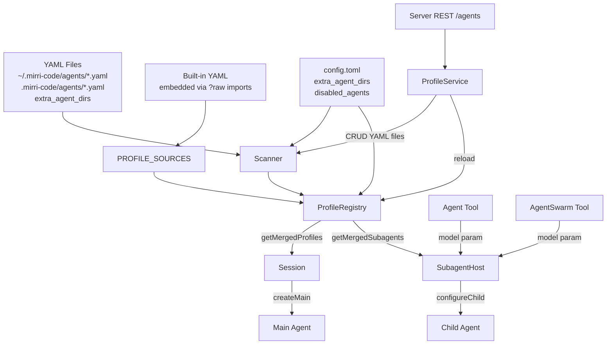

# Custom Agent Profiles — Functional Design

## Architecture Overview



## Discovery Tiering

Mirrors the skills scanner pattern (`skill/scanner.ts`). Profiles are discovered from multiple directories, with first-wins deduplication by name:

| Priority | Source | Path |
|----------|--------|------|
| 1 (highest) | `project` | `<cwd>/.mirri-code/agents/*.yaml` |
| 2 | `user` | `$MIRRICODE_HOME/agents/*.yaml` |
| 3 | `extra` | `config.toml` `extra_agent_dirs` entries |
| 4 (lowest) | `builtin` | Bundled in `packages/agent-core/src/profile/default/` |

A custom profile with the same name as a built-in **partially merges** with the built-in — only fields declared in the custom YAML override the built-in; others are preserved. This lets users override just `defaultModel` without copying the entire built-in definition.

## ProfileRegistry Merge Logic

1. **Load built-in raw profiles** from `DEFAULT_PROFILE_SOURCES` (the embedded YAML + system.md). This preserves `systemPromptPath`, `promptVars`, `subagents`, and `extends`.
2. **Discover custom profiles** from filesystem via scanner. Each custom profile's `systemPromptPath` is resolved relative to the file's directory.
3. **Build the raw profile list**: built-in raw profiles **merged** with custom override if same name (`{ ...builtin, ...custom }`) + custom profiles that aren't built-in overrides.
4. **Resolve all together** via `resolveAgentProfiles()` — handles `extends` inheritance with cycle detection, merges `tools`/`capabilities`/`promptVars`/`defaultModel`, links subagents.
5. **Apply `disabledAgents` filter** from config — set `enabled: false` on matching entries, except `agent` (essential).
6. **Build merged cache** — only enabled profiles appear in `getMergedProfiles()` and `getAvailableSubagents()`.

### Key Design Decision: No `rawFromResolved` Round-Trip

An earlier attempt converted `ResolvedAgentProfile` back to `RawAgentProfile` for re-resolution. This was fundamentally broken — `ResolvedAgentProfile` exposes `systemPrompt` as a renderer function (closure), not the raw template string. The system prompt, `promptVars`, `subagents` declarations, and `extends` metadata were all irrecoverably lost.

The fix: expose `DEFAULT_PROFILE_SOURCES` and `DEFAULT_PROFILE_FILE_PATHS` from `default.ts`, and have the registry call `finalizeRawAgentProfileSource()` to rebuild raw profiles from the embedded YAML sources. This preserves all metadata through the resolution pipeline.

## Model Resolution Precedence

When spawning a subagent, the model is resolved in 3 tiers:

```
options.model (LLM-specified via Agent/AgentSwarm tool)
  → profile.defaultModel (declared in profile YAML, or overridden via partial-merge)
  → parent.config.modelAlias (inherited from parent agent)
```

- If the LLM passes `model: 'gpt-4o'` in the Agent tool call, that takes precedence.
- If the profile declares `defaultModel: 'claude-sonnet'` (or it's overridden via a partial-merge custom YAML), and the LLM doesn't specify, the profile's model is used.
- If neither is set, the subagent inherits the parent agent's model alias (existing behavior).
- The alias must exist in `config.toml`'s `models` map — `ProviderManager.resolveProviderConfig()` throws `CONFIG_INVALID` if not.

### Built-in Model Override via Partial-Merge

Users can override a built-in agent's `defaultModel` without replacing the entire profile. They create a minimal YAML file:

```yaml
# ~/.mirri-code/agents/coder.yaml
name: coder
defaultModel: gpt-4o
```

The registry merges this with the built-in coder definition: only `defaultModel` is overridden; `tools`, `whenToUse`, `promptVars`, `extends`, etc. are all preserved from the built-in.

The `ProfileService.setBuiltinModelOverride(name, model)` method creates/updates/removes these override files. The REST endpoint `POST /agents/{name}:set-model` exposes this.

### Tool Description Model Injection

The `AgentTool` constructor receives an optional `modelCatalog` parameter. When provided, the tool description includes a `## Available Models` section listing each model alias with context size and capabilities, enabling the LLM to choose based on task difficulty.

## Data Flow

```
YAML file → scanner.discoverAgentProfiles() → DiscoveredProfile[]
    ↓
ProfileRegistry.reload() → merge with built-in raw profiles
    → resolveAgentProfiles() → ResolvedAgentProfile[]
    → apply disabledAgents filter
    → cache as getMergedProfiles()
    ↓
Session.createMain() → getMergedProfiles()['agent']
Session.resolvePersistedProfile() → getMergedProfiles()[name]
SubagentHost.resolveProfile() → getMergedProfiles().subagents[name]
SubagentHost.configureChild() → model: options.model ?? profile.defaultModel ?? parent.model
    ↓
ConfigState.update({ modelAlias }) → ProviderManager.resolveProviderConfig()
    → KosongLLM → LLM request with correct model
```

## REST API Surface

| Method | Path | Description |
|--------|------|-------------|
| `GET` | `/api/v1/agents` | List all profiles (built-in + custom) |
| `GET` | `/api/v1/agents/{name}` | Get single profile detail |
| `POST` | `/api/v1/agents` | Create custom profile |
| `PUT` | `/api/v1/agents/{name}` | Update custom profile (reject for builtin) |
| `DELETE` | `/api/v1/agents/{name}` | Delete custom profile (reject for builtin) |
| `POST` | `/api/v1/agents/{name}:enable` | Enable profile |
| `POST` | `/api/v1/agents/{name}:disable` | Disable profile (reject for essential) |
| `POST` | `/api/v1/agents/{name}:set-model` | Set/clear defaultModel override for built-in (body: `{model?: string}`) |

All responses use the standard `{ code, msg, data, request_id }` envelope.

## ProfileService State Machine

```
createProfile → validate name → build raw YAML → atomicWrite to $HOME/agents/<name>.yaml
    → registry.reload() → publish event.agent.profiles_changed

updateProfile → check not builtin → read existing file → merge patch → atomicWrite
    → registry.reload() → publish event.agent.profiles_changed

deleteProfile → check not builtin → rm file
    → registry.reload() → publish event.agent.profiles_changed

disableProfile → check not essential → update config.disabledAgents via configUpdater
    → registry.reload() → publish event.agent.profiles_changed

enableProfile → update config.disabledAgents (remove name) via configUpdater
    → registry.reload() → publish event.agent.profiles_changed
```

## Config Change Reload

`hasProfileRelevantConfigChange(changedFields)` is a pure predicate that checks if any of the changed config fields are relevant to profile discovery:
- `disabled_agents` → triggers reload (profile enable/disable state changes)
- `extra_agent_dirs` → triggers reload (new discovery directories)

The `ConfigService.set()` publishes `event.config.changed` with `changedFields`. A subscriber checks the predicate and calls `registry.reload()` if relevant.

## Dynamic Subagent Discovery

`ProfileRegistry.getAvailableSubagents()` is the single source of truth for "which subagents can be dispatched right now." It combines:

1. Declared subagents from the `agent` profile's `subagents` field (coder, explore, plan) — filtered by enabled state
2. All other enabled non-essential profiles (custom agents) — added automatically

`Session.getAvailableSubagents()` delegates to the registry (or falls back to `DEFAULT_AGENT_PROFILES['agent']?.subagents` when no registry is configured).

`SessionSubagentHost.getAvailableSubagents()` proxies to the session.

`AgentTool` and `AgentSwarmTool` use this via a provider function (`() => Record<string, ResolvedAgentProfile>`) to build their `description` getter dynamically — the LLM sees exactly the agents that are enabled and dispatchable.

`SessionSubagentHost.resolveProfile()` uses `getAvailableSubagents()` as primary lookup. Disabled agents throw "not found or is disabled." A fallback to `getMergedProfiles()[name]` allows resume of agents that were disabled mid-session (but new spawns are blocked).

## Security Considerations

1. **YAML validation**: All custom profile YAML files are parsed with `js-yaml` (safe mode) and validated against `RawAgentProfileSchema`. Invalid files are silently skipped.
2. **`extends` cycle detection**: `resolveAgentProfiles()` already has built-in cycle detection that throws on circular `extends` chains.
3. **Path traversal**: Profile names must match `/^[a-z0-9-]+$/` (kebab-case) — rejects names containing `/`, `\`, or `..`.
4. **No arbitrary code execution**: YAML is parsed in safe mode; no `!!js/function` or similar tags are evaluated.
5. **Built-in read-only**: Built-in profiles cannot be created (name collision), updated, or deleted via the service or REST API.
6. **Essential protection**: The `agent` profile cannot be disabled — `disabledAgents` entries for `agent` are silently ignored.

## Module Boundaries

| Module | Responsibility |
|--------|---------------|
| `profile/scanner.ts` | Filesystem discovery of custom profiles |
| `profile/registry.ts` | Merging built-in + custom profiles (partial-merge), caching, `getAvailableSubagents()` |
| `profile/types.ts` | Schema definitions (RawAgentProfile, ResolvedAgentProfile) |
| `profile/resolve.ts` | Profile resolution (extends, cycle detection, subagent linking, defaultModel `??` inheritance) |
| `profile/default.ts` | Built-in profile sources + DEFAULT_AGENT_PROFILES |
| `services/profile/profile.ts` | IProfileService interface (incl. `setBuiltinModelOverride`) |
| `services/profile/profileService.ts` | CRUD implementation + `setBuiltinModelOverride` + config change predicate |
| `config/schema.ts` | extraAgentDirs, disabledAgents config fields |
| `config/toml.ts` | TOML serialization for new fields |
| `session/index.ts` | Session.getMergedProfiles() + getAvailableSubagents() + profileRegistry field |
| `session/subagent-host.ts` | configureChild with 3-tier model resolution + getAvailableSubagents proxy + resolveProfile with enabled filtering |
| `session/subagent-batch.ts` | QueuedSubagentTask.model field threading |
| `tools/builtin/collaboration/agent.ts` | AgentTool: model input + dynamic description getter via subagentProvider |
| `tools/builtin/collaboration/agent-swarm.ts` | AgentSwarmTool: model input + dynamic description getter via subagentHost.getAvailableSubagents |
| `agent/tool/index.ts` | ToolManager: passes provider function to AgentTool instead of static subagents |
| `protocol/rest/agents.ts` | REST request/response schemas |
| `protocol/src/events.ts` | AgentProfilesChangedEvent |
| `protocol/src/error-codes.ts` | AGENT_PROFILE_* error codes |
| `server/src/routes/agents.ts` | REST route handlers (incl. `:set-model` action) |
| `apps/mirri-web/src/components/settings/AgentManager.vue` | Agent list + model dropdown + ToolTagEditor integration + extends auto-fill |
| `apps/mirri-web/src/components/settings/ToolTagEditor.vue` | Tag editor with autocomplete (builtin + MCP server/tool) |
| `apps/mirri-web/src/api/daemon/client.ts` | listTools(), listMcpServers(), setAgentModel() |
| `apps/mirri-web/src/api/types.ts` | AppToolDescriptor, AppMcpServer types |
| `apps/mirri-web/src/api/daemon/wire.ts` | WireToolDescriptor, WireMcpServer DTOs |

## Detailed Spec

### Agent Profile YAML Schema

```yaml
name: my-reviewer          # required, kebab-case ([a-z0-9-]+)
extends: coder             # optional, inherit from another profile
description: Code reviewer # optional, shown in UI
defaultModel: gpt-4o      # optional, model alias (must exist in config.toml models)
whenToUse: Use for reviews # optional, guidance for LLM subagent selection
tools:                      # optional, tool names list (overrides parent)
  - Read
  - Grep
  - mcp__*                 # MCP glob patterns
systemPromptTemplate: |    # optional, inline system prompt
  You are a code reviewer...
systemPromptPath: ./prompt.md  # optional, external prompt file (relative to YAML)
promptVars:                 # optional, template variables (shallow-merged with parent)
  roleAdditional: |
    Focus on security...
capabilities: [code.read]           # optional, capability declarations
capabilitiesRequired: [code.read]   # optional, gates which tools are visible
subagents:                          # optional, declare subagents this profile can spawn
  coder:
    description: Coding agent
```

### Partial-Merge Semantics

When a custom YAML file has the same name as a built-in:

```typescript
// In ProfileRegistry.reload():
const customOverride = customByName.get(raw.name);
if (customOverride !== undefined) {
  allRaw.push({ ...raw, ...customOverride.raw });  // spread merge
} else {
  allRaw.push(raw);
}
```

- Custom YAML fields that **exist** override the built-in's values.
- Custom YAML fields that **don't exist** (parsed as `undefined` by zod) do not overwrite — the built-in's value is preserved.
- `tools` array: if the custom YAML declares `tools`, it replaces the built-in's tools entirely (not append). If not declared, built-in tools are preserved.
- `promptVars`: shallow-merged (parent as base, custom keys override).

### getAvailableSubagents() Algorithm

```typescript
getAvailableSubagents(parentProfileName?: string): Record<string, ResolvedAgentProfile> {
  // 1. Get declared subagents from parent profile
  const declared = parent?.subagents ?? {};
  const result: Record<string, ResolvedAgentProfile> = {};

  // 2. Add declared subagents that are enabled (or have no entry — backwards compat)
  for (const [name, profile] of Object.entries(declared)) {
    const entry = this.entries.get(name);
    if (entry === undefined || entry.enabled) {
      result[name] = profile;
    }
  }

  // 3. Add all other enabled non-essential profiles (custom agents)
  for (const [name, entry] of this.entries) {
    if (entry.essential) continue;              // skip 'agent' itself
    if (result[name] !== undefined) continue;    // already in declared subagents
    if (!entry.enabled) continue;               // skip disabled
    result[name] = entry.profile;
  }

  return result;
}
```

### resolveProfile() with Enabled Filtering

```typescript
private resolveProfile(parent: Agent, profileName: string): ResolvedAgentProfile {
  // Primary: available subagents (respects enabled/disabled)
  const subagents = this.session.getAvailableSubagents();
  const profile = subagents[profileName];
  if (profile !== undefined) return profile;

  // Fallback: allow resume of agents disabled mid-session
  // (only top-level profiles, NOT nested agent.subagents — those bypass filtering)
  const allProfiles = this.session.getMergedProfiles();
  const fallback = allProfiles[profileName];
  if (fallback !== undefined) return fallback;

  throw new Error(`Subagent profile "${profileName}" was not found or is disabled`);
}
```

### AgentTool / AgentSwarmTool Dynamic Description

```typescript
// AgentTool: constructor accepts a provider function
constructor(
  subagentHost: SessionSubagentHost,
  backgroundManager: BackgroundManager,
  subagentProvider?: (() => Subagents) | Subagents | undefined,
  options?: { ... },
) {
  this._subagentProvider = typeof subagentProvider === 'function'
    ? subagentProvider
    : () => subagentProvider ?? undefined;
}

get description(): string {
  const subagents = this._subagentProvider();
  const typeLines = buildSubagentDescriptions(subagents);
  return typeLines
    ? `${this._baseDescription}\n\nAvailable agent types (pass via subagent_type):\n${typeLines}`
    : this._baseDescription;
}

// AgentSwarmTool: uses subagentHost.getAvailableSubagents directly
get description(): string {
  const subagents = this.subagentHost.getAvailableSubagents?.();
  const typeLines = subagents ? buildSubagentDescriptions(subagents) : '';
  return typeLines
    ? `${AGENT_SWARM_DESCRIPTION}\n\nAvailable agent types (pass via subagent_type):\n${typeLines}`
    : AGENT_SWARM_DESCRIPTION;
}
```

### setBuiltinModelOverride()

```typescript
async setBuiltinModelOverride(name: string, model: string | undefined): Promise<void> {
  // Validate: profile exists, not essential
  const entry = this.registry.getEntry(name);
  if (entry === undefined) throw new Error(`Agent profile "${name}" was not found`);
  if (ESSENTIAL_PROFILES.has(name)) throw new Error(`... is essential and cannot be overridden`);

  const filePath = join(this.homeDir, 'agents', `${name}.yaml`);

  if (model === undefined) {
    // Remove override file
    await rm(filePath).catch((e) => { if (e.code !== 'ENOENT') throw e; });
  } else {
    // Write minimal override: only name + defaultModel
    await atomicWrite(filePath, dumpYaml({ name, defaultModel: model }));
  }

  await this.registry.reload();
  this.publishProfilesChanged();
}
```

### REST API

| Method | Path | Description |
|--------|------|-------------|
| `GET` | `/agents` | List all profiles (built-in + custom) |
| `GET` | `/agents/{name}` | Get single profile detail |
| `POST` | `/agents` | Create custom profile |
| `PUT` | `/agents/{name}` | Update custom profile (reject for builtin) |
| `DELETE` | `/agents/{name}` | Delete custom profile (reject for builtin) |
| `POST` | `/agents/{name}:enable` | Enable profile |
| `POST` | `/agents/{name}:disable` | Disable profile (reject for essential) |
| `POST` | `/agents/{name}:set-model` | Set/clear defaultModel override (body: `{model?: string}`) |
| `GET` | `/tools` | List all available tools (builtin + MCP) |
| `GET` | `/mcp/servers` | List configured MCP servers |

All responses use the standard `{ code, msg, data, request_id }` envelope.

### Config.toml Fields

```toml
# Agent discovery directories
extra_agent_dirs = ["/path/to/agents"]

# Disabled agents (essential "agent" cannot be disabled)
disabled_agents = ["explore"]
```

### Web UI Components

**AgentManager.vue:**
- Profile list with enable/disable toggle, source badge, essential badge
- Model `<Select>` dropdown next to each built-in non-essential agent
- Create/edit form with:
  - Name input (kebab-case)
  - Description input
  - Extends `<Select>` (agent, coder, explore, plan + custom)
  - Default model `<Select>` (from `GET /models`)
  - Tool tag editor (`ToolTagEditor.vue`)
  - When-to-use input
  - Role instructions textarea

**ToolTagEditor.vue:**
- Props: `modelValue: string[]`, `availableTools: AppToolDescriptor[]`, `mcpServers: AppMcpServer[]`
- Selected tools shown as removable tag chips
- Input field with filtered autocomplete suggestions
- Suggestion categories:
  - Builtin tools (name + description)
  - MCP server-level (`mcp__<server>__*` — all tools from server)
  - MCP tool-level (`mcp__<server>__<tool>` — specific tool)
- Keyboard: Enter to add, Backspace on empty to remove last tag
