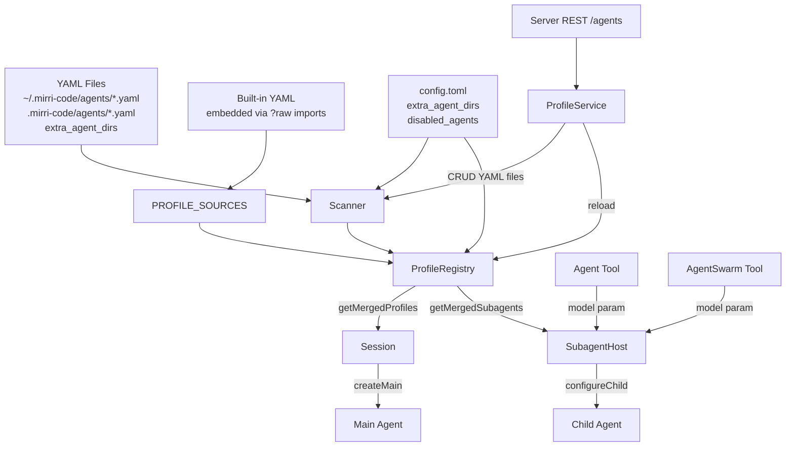

# Custom Agent Profiles — Functional Design

## Architecture Overview



## Discovery Tiering

Mirrors the skills scanner pattern (`skill/scanner.ts`). Profiles are discovered from multiple directories, with first-wins deduplication by name:

| Priority | Source | Path |
|----------|--------|------|
| 1 (highest) | `project` | `<cwd>/.mirri-code/agents/*.yaml` |
| 2 | `user` | `$MIRRICODE_HOME/agents/*.yaml` |
| 3 | `extra` | `config.toml` `extra_agent_dirs` entries |
| 4 (lowest) | `builtin` | Bundled in `packages/agent-core/src/profile/default/` |

A custom profile with the same name as a built-in replaces the built-in in the merged set.

## ProfileRegistry Merge Logic

1. **Load built-in raw profiles** from `DEFAULT_PROFILE_SOURCES` (the embedded YAML + system.md). This preserves `systemPromptPath`, `promptVars`, `subagents`, and `extends`.
2. **Discover custom profiles** from filesystem via scanner. Each custom profile's `systemPromptPath` is resolved relative to the file's directory.
3. **Build the raw profile list**: built-in raw profiles (replaced by custom override if same name) + custom profiles that aren't built-in overrides.
4. **Resolve all together** via `resolveAgentProfiles()` — handles `extends` inheritance with cycle detection, merges `tools`/`capabilities`/`promptVars`/`defaultModel`, links subagents.
5. **Apply `disabledAgents` filter** from config — set `enabled: false` on matching entries, except `agent` (essential).
6. **Build merged cache** — only enabled profiles appear in `getMergedProfiles()`.

### Key Design Decision: No `rawFromResolved` Round-Trip

An earlier attempt converted `ResolvedAgentProfile` back to `RawAgentProfile` for re-resolution. This was fundamentally broken — `ResolvedAgentProfile` exposes `systemPrompt` as a renderer function (closure), not the raw template string. The system prompt, `promptVars`, `subagents` declarations, and `extends` metadata were all irrecoverably lost.

The fix: expose `DEFAULT_PROFILE_SOURCES` and `DEFAULT_PROFILE_FILE_PATHS` from `default.ts`, and have the registry call `finalizeRawAgentProfileSource()` to rebuild raw profiles from the embedded YAML sources. This preserves all metadata through the resolution pipeline.

## Model Resolution Precedence

When spawning a subagent, the model is resolved in 3 tiers:

```
options.model (LLM-specified via Agent/AgentSwarm tool)
  → profile.defaultModel (declared in profile YAML)
  → parent.config.modelAlias (inherited from parent agent)
```

- If the LLM passes `model: 'gpt-4o'` in the Agent tool call, that takes precedence.
- If the profile declares `defaultModel: 'claude-sonnet'`, and the LLM doesn't specify, the profile's model is used.
- If neither is set, the subagent inherits the parent agent's model alias (existing behavior).
- The alias must exist in `config.toml`'s `models` map — `ProviderManager.resolveProviderConfig()` throws `CONFIG_INVALID` if not.

### Tool Description Model Injection

The `AgentTool` constructor receives an optional `modelCatalog` parameter. When provided, the tool description includes a `## Available Models` section listing each model alias with context size and capabilities, enabling the LLM to choose based on task difficulty.

## Data Flow

```
YAML file → scanner.discoverAgentProfiles() → DiscoveredProfile[]
    ↓
ProfileRegistry.reload() → merge with built-in raw profiles
    → resolveAgentProfiles() → ResolvedAgentProfile[]
    → apply disabledAgents filter
    → cache as getMergedProfiles()
    ↓
Session.createMain() → getMergedProfiles()['agent']
Session.resolvePersistedProfile() → getMergedProfiles()[name]
SubagentHost.resolveProfile() → getMergedProfiles().subagents[name]
SubagentHost.configureChild() → model: options.model ?? profile.defaultModel ?? parent.model
    ↓
ConfigState.update({ modelAlias }) → ProviderManager.resolveProviderConfig()
    → KosongLLM → LLM request with correct model
```

## REST API Surface

| Method | Path | Description |
|--------|------|-------------|
| `GET` | `/api/v1/agents` | List all profiles (built-in + custom) |
| `GET` | `/api/v1/agents/{name}` | Get single profile detail |
| `POST` | `/api/v1/agents` | Create custom profile |
| `PUT` | `/api/v1/agents/{name}` | Update custom profile (reject for builtin) |
| `DELETE` | `/api/v1/agents/{name}` | Delete custom profile (reject for builtin) |
| `POST` | `/api/v1/agents/{name}:enable` | Enable profile |
| `POST` | `/api/v1/agents/{name}:disable` | Disable profile (reject for essential) |

All responses use the standard `{ code, msg, data, request_id }` envelope.

## ProfileService State Machine

```
createProfile → validate name → build raw YAML → atomicWrite to $HOME/agents/<name>.yaml
    → registry.reload() → publish event.agent.profiles_changed

updateProfile → check not builtin → read existing file → merge patch → atomicWrite
    → registry.reload() → publish event.agent.profiles_changed

deleteProfile → check not builtin → rm file
    → registry.reload() → publish event.agent.profiles_changed

disableProfile → check not essential → update config.disabledAgents via configUpdater
    → registry.reload() → publish event.agent.profiles_changed

enableProfile → update config.disabledAgents (remove name) via configUpdater
    → registry.reload() → publish event.agent.profiles_changed
```

## Config Change Reload

`hasProfileRelevantConfigChange(changedFields)` is a pure predicate that checks if any of the changed config fields are relevant to profile discovery:
- `disabled_agents` → triggers reload (profile enable/disable state changes)
- `extra_agent_dirs` → triggers reload (new discovery directories)

The `ConfigService.set()` publishes `event.config.changed` with `changedFields`. A subscriber checks the predicate and calls `registry.reload()` if relevant.

## Security Considerations

1. **YAML validation**: All custom profile YAML files are parsed with `js-yaml` (safe mode) and validated against `RawAgentProfileSchema`. Invalid files are silently skipped.
2. **`extends` cycle detection**: `resolveAgentProfiles()` already has built-in cycle detection that throws on circular `extends` chains.
3. **Path traversal**: Profile names must match `/^[a-z0-9-]+$/` (kebab-case) — rejects names containing `/`, `\`, or `..`.
4. **No arbitrary code execution**: YAML is parsed in safe mode; no `!!js/function` or similar tags are evaluated.
5. **Built-in read-only**: Built-in profiles cannot be created (name collision), updated, or deleted via the service or REST API.
6. **Essential protection**: The `agent` profile cannot be disabled — `disabledAgents` entries for `agent` are silently ignored.

## Module Boundaries

| Module | Responsibility |
|--------|---------------|
| `profile/scanner.ts` | Filesystem discovery of custom profiles |
| `profile/registry.ts` | Merging built-in + custom profiles, caching |
| `profile/types.ts` | Schema definitions (RawAgentProfile, ResolvedAgentProfile) |
| `profile/resolve.ts` | Profile resolution (extends, cycle detection, subagent linking) |
| `profile/default.ts` | Built-in profile sources + DEFAULT_AGENT_PROFILES |
| `services/profile/profile.ts` | IProfileService interface |
| `services/profile/profileService.ts` | CRUD implementation + config change predicate |
| `config/schema.ts` | extraAgentDirs, disabledAgents config fields |
| `config/toml.ts` | TOML serialization for new fields |
| `session/index.ts` | Session.getMergedProfiles() + profileRegistry field |
| `session/subagent-host.ts` | configureChild with 3-tier model resolution |
| `session/subagent-batch.ts` | QueuedSubagentTask.model field threading |
| `tools/builtin/collaboration/agent.ts` | AgentTool model input + description |
| `tools/builtin/collaboration/agent-swarm.ts` | AgentSwarmTool model input |
| `protocol/rest/agents.ts` | REST request/response schemas |
| `protocol/src/events.ts` | AgentProfilesChangedEvent |
| `protocol/src/error-codes.ts` | AGENT_PROFILE_* error codes |
| `server/src/routes/agents.ts` | REST route handlers |
